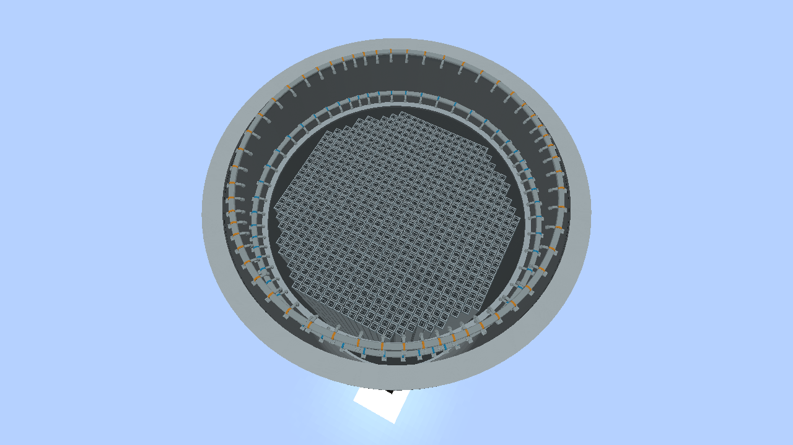
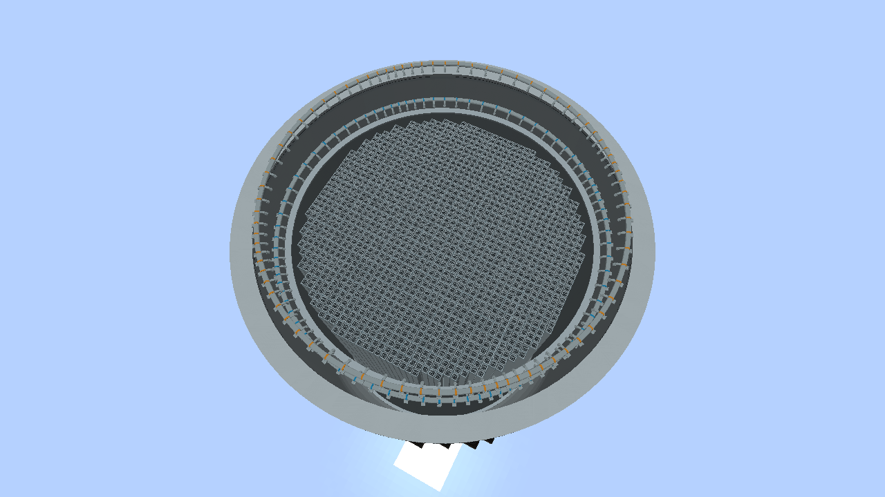
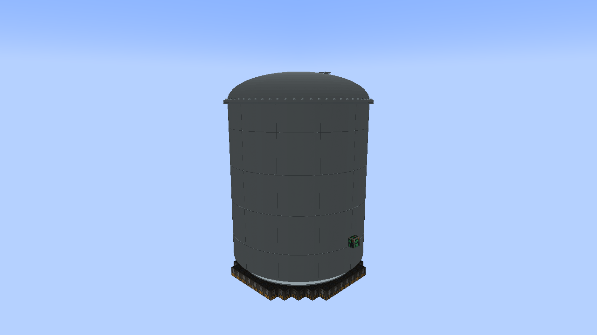

# Columbia core references and scalable internals

## Source

Energy Northwest, **Columbia Generating Station Final Safety Analysis Report,
Amendment 67**, public edition, NRC ADAMS **ML23346A215**. The supplied PDF is
5,262 pages and approximately 404 MiB. Downloaded September 26, 2026.
The local reference copy is outside the repository at
`../references/columbia/Columbia FSAR.pdf`; it is not bundled in the mod.
Some retained figures have earlier amendment dates printed on their pages.

| Reference | PDF page (1-based) | Useful content |
| --- | ---: | --- |
| Section 4.1.2 | 1922-1928 | Fuel, core shroud, top guide, core plate, bottom-entry controls, separators and dryer |
| Figure 4.3-1 | 1971 | Quadrant core layout, shroud, vessel and jet-pump locations |
| Figure 5.3-5 | 2158 | Labeled reactor vessel cutaway and internal component order |
| Figure 4.2-1.1 | 1956 | Original cruciform control blade and lifting handle |
| Figures 4.2-1.2 through 4.2-1.5 | 1957-1960 | Replacement control-blade drawings |
| Section 4.6.1.1.2 | 1998-2001 | Bottom-entry hydraulic CRD housing, flanges, coupling and position indicator |
| Figures 4.6-1 / 4.6-2 / 4.6-3 | 2031-2033 | Rod coupling and detailed control rod drive unit schematics |
| Figure 4.1-1 | 1939 | Steam separator cutaway |
| Figure 4.1-2 | 1940 | Steam dryer panels |
| Table 4.3-3 | 1970 | Neutronic design values |
| Table 4.4-1 | 1981 | Thermal/hydraulic characteristics |
| Figure 5.3-3 | 2156 | Vessel elevations and active fuel zone |

Figure 4.3-1 is a layout/reference diagram, **not a current cycle-specific
fuel-loading map**. Section 4.1 says loading changes by cycle. Deleted figures
4.1-3 and tables 4.3-2 / 4.4-2 cannot supply the missing loading details.
The numbered regions in the quadrant diagram are not interpreted as fuel grades.

## Verified plant characteristics

Table 4.3-3 gives **764 assemblies**, **3,544 MW thermal**, **108.5 million lb/h
rated core flow**, **1,035 psia steam-dome pressure**, and **6.00-inch assembly
pitch**. The pressure is absolute, not gauge pressure.
Table 4.4-1 gives **15.28 million lb/h steam flow** at **422.1 F final feedwater
temperature**, **89.7-115 million lb/h core coolant flow range**, and **551 F
saturation temperature at core design pressure**. Its 3,702 MW value is an
engineered-safety-features analysis power, not the rated operating thermal power.
Some heat-transfer-area rows in that table have repeated labels; they were not
used to infer dimensions or alter the simulation.

Section 4.1.2 describes four fuel assemblies on a fuel-support piece at each
control-rod guide tube, with some peripheral assemblies supported by the core
plate. The top guide supports the assemblies laterally, and the cruciform
controls enter from below. These relationships guide the new artwork.

## In the mod

- Blender-authored channel walls, upper tie plates, lifting bails, lower inlet
  supports, open top-guide cells, guide tubes, cruciform blades, shroud and rims.
- Every visible fuel channel corresponds to an occupied position in the saved
  reactor loading. Empty positions show the open grid/support. Specialty inserts
  use a distinct cap. The player's fuel menu remains the loading interface.
- The existing rounded **version-2 game mask** is retained: 88 positions at
  7 x 7, 764 at 17 x 17 and 1,476 at 23 x 23 exterior footprint. Rectangular
  vessels also scale. This is not a claim that every game slot matches Columbia's
  physical map. Legacy version-1 cores retain their original capacity and IDs.
- Core cross-section fits within the shroud, with clearance at the corners of
  peripheral support cells. Height follows the game's active-fuel region beneath
  the existing spray rings. The large logical capacity is visually compressed
  into the existing construction envelope; it is not a one-metre engineering model.
- Removing the head in the existing refuelling mode reveals the core. Opening
  the real plant also requires removing upper internals; the game currently
  omits that handling step and does not yet model the separator/dryer assemblies.
- Blade insertion is taken from the server's actual rod positions. Only the
  inserted portion is displayed; the withdrawn length is concealed below the
  support plane. It is a visual representation, not a new moving collision entity.
- Vessel heads now have continuous inner and outer steel surfaces and closed
  poles. Barrel/head/flange seams overlap slightly to avoid cracks across scales.
  Existing block locations, port faces, collision and pipe connections remain.

## Rendering and compatibility

The server sends a bounded visual loading snapshot through the existing block
update channel. Clients never recompute reactor physics. Fuel changes replace
the core mesh only; they do not invalidate the shell or its chunk visibility.
Stationary core parts use the existing GPU mesh cache. Moving blades share one
GPU mesh and change transforms rather than rebuilding the complete core.
Closed vessels skip the internal draw when the camera is outside their bounds.
There are no extra ticking blocks or per-frame world searches.

Missing old visual tags display no invented fuel. The alpha.15 visual update preserved core masks,
hydraulics, kinetics, inventories and control IDs. Alpha.17 replaces the
alpha.16 per-pump exclusions with one smaller continuous core and shroud inside
a peripheral RIP ring. Surviving drives are remapped by physical location; see
[internal pumps and the hydraulic CRD](INTERNAL-PUMPS.md) for ABWR references
and the game-space tradeoff. Player-written protection logic remains
player-controlled. Alpha.18 expands that continuous core by adjusting the
limiting pump sites outward. Alpha.19 uses GE ABWR Table 5.3-2 for the visible
shroud and annulus, independently of the saved fuel/drive capacity mask. See
[the ABWR dimensions and Blender sources](INTERNAL-PUMPS.md#abwr-proportions-alpha19). Alpha.20 fills the usable perimeter with additional fuel and blades while
preserving existing slots; eight extra drives are required at 17 × 17. Install alpha.20 on
client and server for matching behavior and visuals.

Blender sources: `art/models/reactor_core/build_models.py` and
`art/models/reactor_core/reactor_core.blend`. Export with
`tools-export-reactor-core.py`; `--check` verifies the shipped assets.

## Reviewed in-game views

These are captures from the disposable Minecraft client test, not Blender renders.

