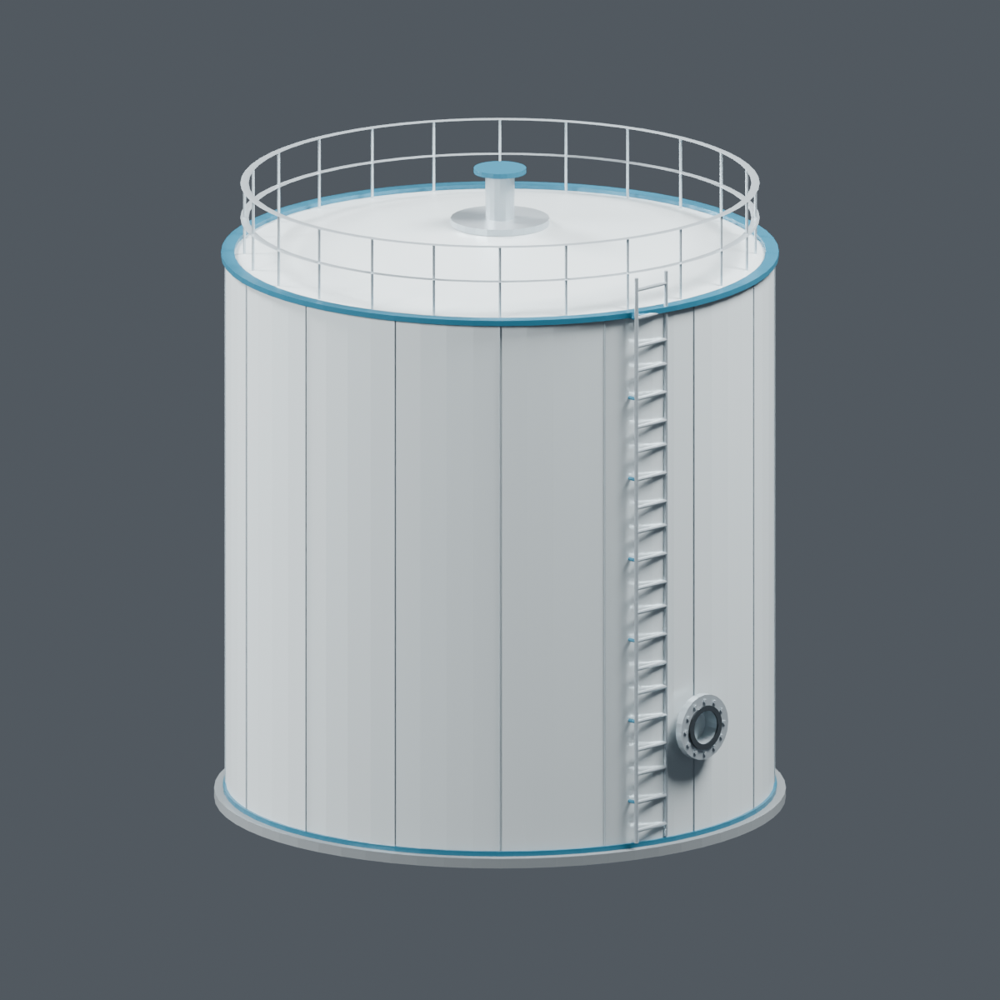
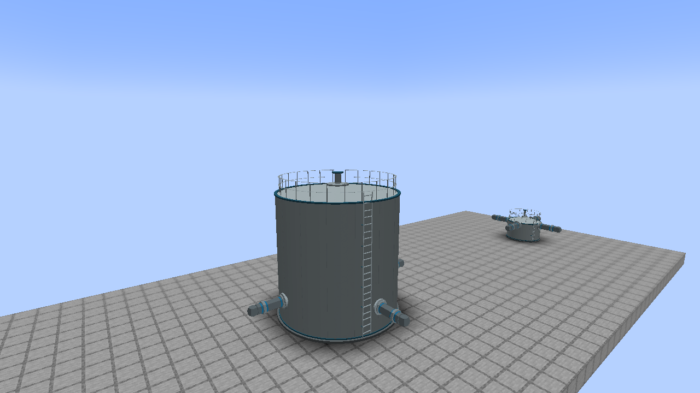
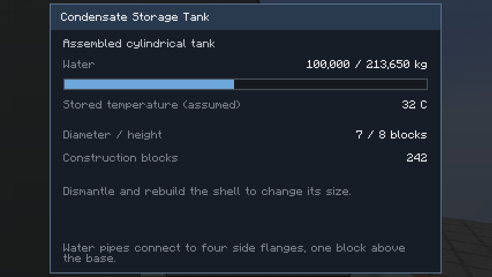

# Scalable condensate storage tank

The existing Condensate Storage Tank item now assembles a cylindrical multiblock.
Its components are modeled in Blender: an enamel shell, shallow cone roof, roof
railing, vent, access ladder, concrete plinth and four full-size pipe flanges.
The unassembled block uses a simple casing texture.

## Build and change size

1. Build a **complete box** from Condensate Storage Tank blocks: a floor, four
   walls and roof. Keep the interior empty. Width and depth must match and be
   an odd **3–15 blocks**; height is **3–24 blocks**, including floor and roof.
2. Placing the final missing shell block automatically forms the cylinder.
   There is no Assemble button or manual size selection. A filled box is also
   accepted, but a hollow shell uses fewer blocks.
3. Right-click any assembled part to see capacity, stored water and dimensions.
   To change size, drain and dismantle the tank, then build the desired box.

The cylinder occupies the box footprint, leaving the outside corners clear.
Stand clear during formation. Obstructions, unloaded space, protected areas,
and insufficient capacity prevent formation without consuming the box. The
combined available water of the placed blocks, including fractional withdrawals,
is preserved. Four full-size flanges appear one block above the base.
Keep the full structure loaded to transfer water.

Breaking any part dismantles the cylinder into ordinary, recoverable casing
blocks. Mine the broken part with a suitable pickaxe in survival to receive its
normal drop; creative breaking and unsuitable tools consume only that part.
The remaining casings stay in the world. Any construction blocks beyond the
number of casing positions are refunded as item stacks. Collision-only cells
do not create extra materials. The surviving casings follow the cylinder's
footprint; rebuild them into a box to form the tank again.

Sections in unloaded chunks are restored when those chunks become available;
pending restorations are saved with the world. **Drain the tank before breaking
it:** dismantling does not preserve its water.

## Capacity and connections

Capacity follows the modeled cylinder, using this initial game approximation:

```text
capacity (kg) = floor(pi * (0.47 * diameter - 0.08)^2 * (height - 1.4) * 1000)
```

The height allowance represents the foundation, roof and freeboard. One mB is
one kg in this mod. All tank parts share one finite inventory, and all ports
share the same fractional pump-withdrawal accounting.

There is one water flange at the center of each cardinal side, **one block above
the base**, facing outward. Connect BWR High-Pressure Water Pipe or Mekanism
Mechanical Pipe. Each flange accepts or supplies water; the connected pump or
pipe determines flow direction. Steam pipes do not connect. Existing feedwater,
emergency and cooling-water pumps can draw from the assembled tank.

Buckets work on the tank, and CC:Tweaked keeps the existing type
`bwr_condensate_tank`. The existing `getStored`, `getCapacity`, `getLevel`,
`getTemperature`, and `getStatus` calls remain available. `getStatus` now also
reports `assembled`, `ready`, `diameter`, and `height`. Size construction is a
local player action, so computers cannot bypass the material cost.

Stored water now mixes by mass and enthalpy, including during automatic
formation and reload. Older untagged inventories retain the former 32 C value;
new untagged external water enters at 13 C. Water chemistry is unchanged. See
[temperature transport and third-party compatibility](PLANT-TRANSPORT.md).

## Existing worlds

Old single-block tanks retain their **2,000,000 kg** capacity and saved water.
Build a valid tank shell around an old block to convert it. A full old tank
needs a sufficiently large box or must be drained before conversion. Updating the mod
does not automatically expand tanks into nearby blocks.

## Source and validation

Blender sources and renders: `art/models/condensate_tank/`. Re-export the five
components with `python tools-export-condensate-tank.py`; use `--check` to verify
the generated OBJ/MTL/model resources. Models are original geometry; no external
mesh was imported.

Server checks cover legacy water, minimum/medium/maximum sizes, pipe faces,
shared storage, fractional persistence, obstruction rejection, survival material
cost/refund and dismantling, including actual player mining and deferred
restoration across unloaded chunks. The opt-in client check is
`:mod:runTurbineModelCheck -PbwrTankPanelCheck`; it also captures the recovered
casings after breaking the middle tank.






