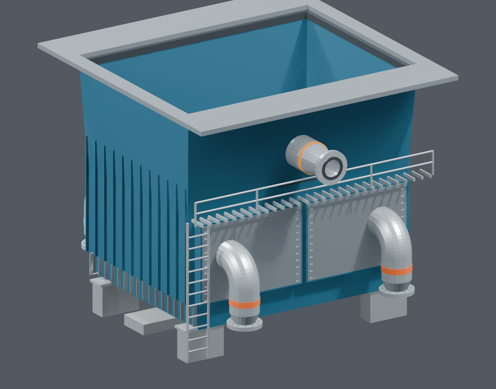
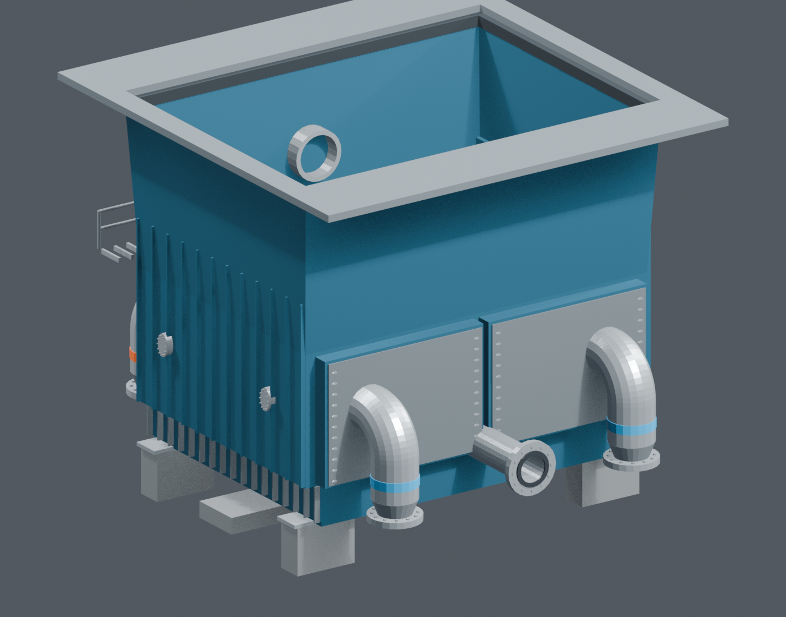
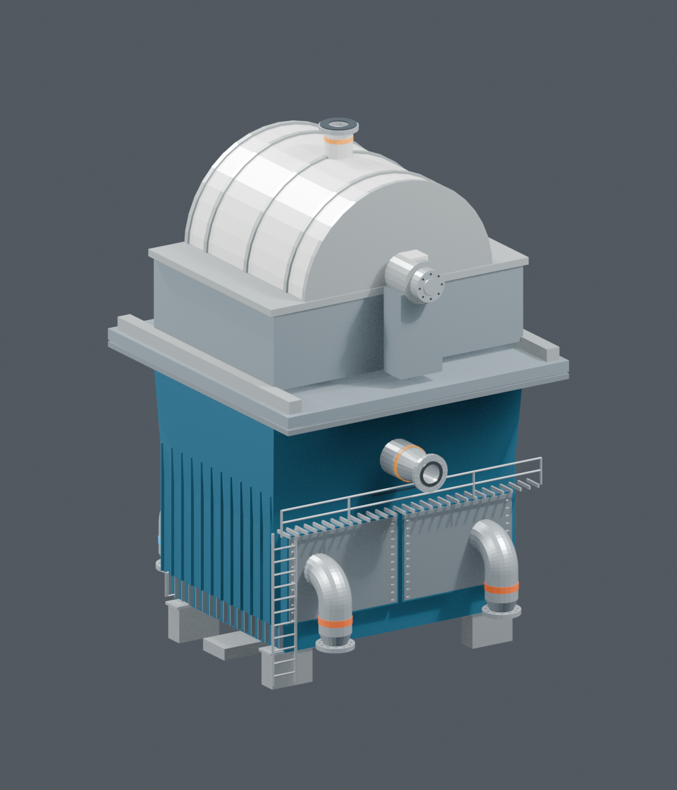
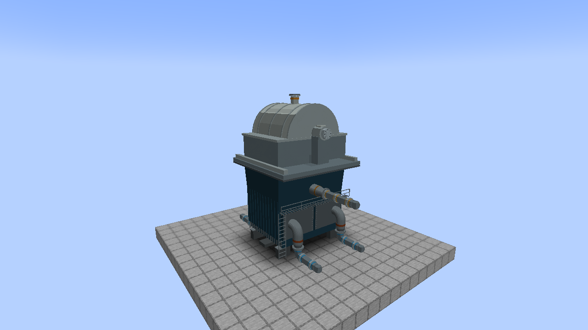
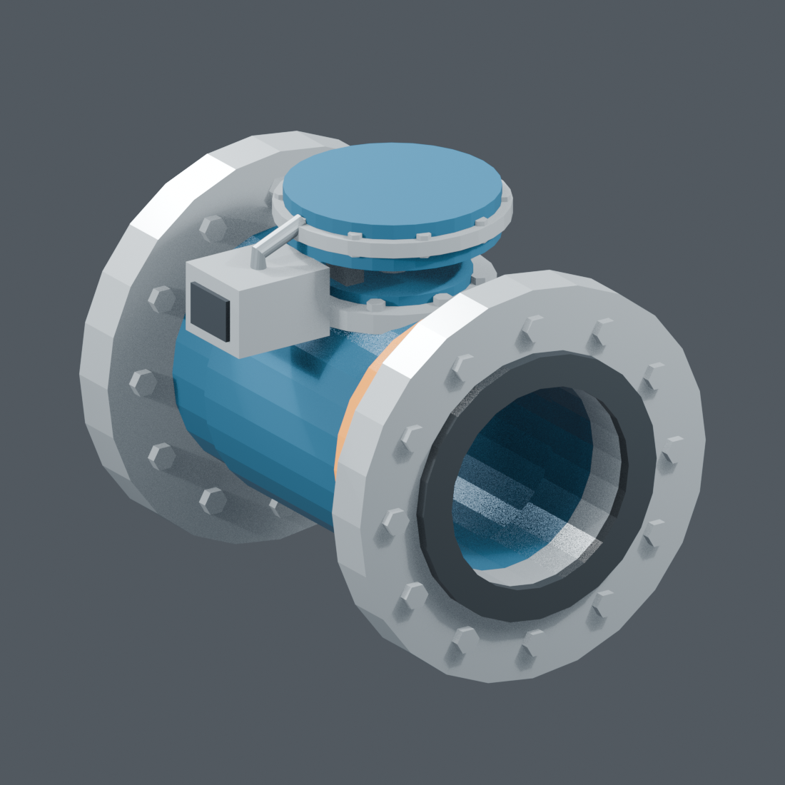
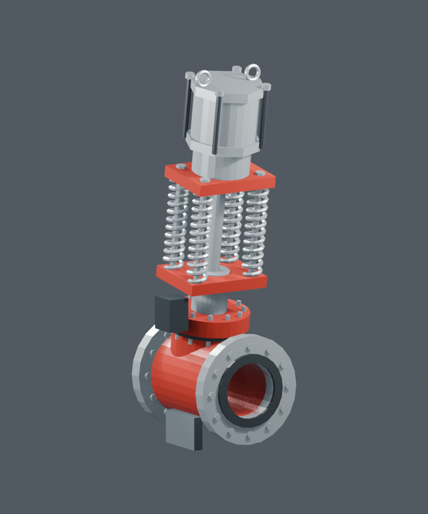
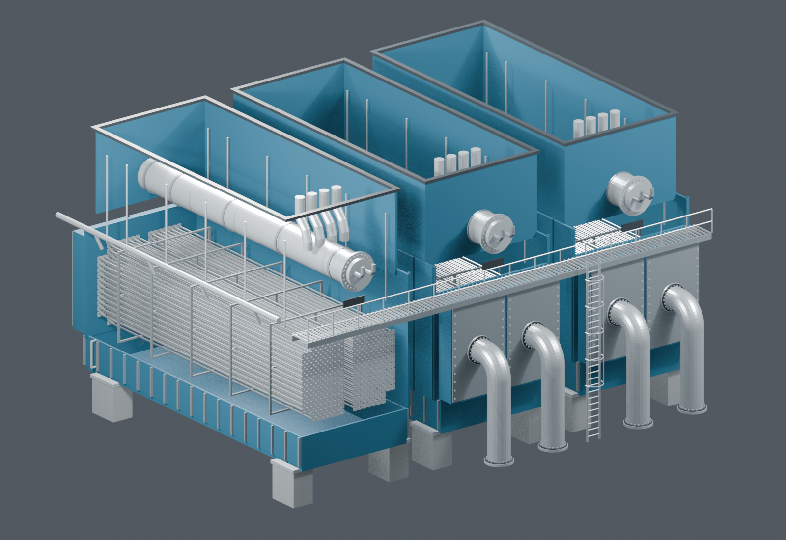

# Condenser ports, steam bypass valve and modeled MSIV

## Condenser: placeable steam bypass and cooling ports

The **Arabelle-style 1700 MW Condenser** is now a placeable machine
(`bwr:arabelle_condenser`). It uses the **closed exterior**, with all shell
panels fitted. Each compact unit fits beneath **one LP turbine**, with a tapered
top collar shaped against the actual turbine skid and lower casing in Blender.
The top opening seats the LP exhaust. A matching LP six blocks above the
condenser controller transfers exhaust directly into its steam inventory.

The transition panels now overlap the lower casing behind the catwalk on both
front and rear faces, closing the former horizontal gap. Existing compact
condensers receive this visual fix after updating the mod; no replacement is needed.



Allow **7 blocks wide, 6 high and 7 deep**. Place the center foundation;
the model turns with the player's facing. Place the LP turbine's center foundation
**six blocks directly above** the condenser's placement block, facing the same
direction. The two footprints align without overlapping occupied cells.
Occupied parts must be clear and
loaded. Breaking a part removes the assembly; a suitable pickaxe returns one
item. Right-click any part for inventories, flow and heat-rejection readings.

| Connections | Count | Location and direction | Supported pipe |
| --- | --- | --- | --- |
| Bypass steam **in** | 1 | Upper front, facing outward above the walkway | BWR High-Pressure Steam Pipe |
| Hot cooling water **out** | 2 | Front elbows, downward-facing bottom flanges, orange bands | BWR water pipe or Mekanism Mechanical Pipe |
| Cold cooling water **in** | 2 | Opposite/rear elbows, downward-facing bottom flanges, blue bands | BWR water pipe or Mekanism Mechanical Pipe |
| Condensate **out** | 1 | Small horizontal rear nozzle between the cold-water elbows | BWR water pipe or Mekanism Mechanical Pipe |

All flanges meet block-face centers directly. The red-circled upper locations
in the supplied reference are repurposed as bypass inlets for gameplay; this
is an interpretation of that request, not an assertion about the photographed
manufacturer equipment. Non-port faces accept neither water nor steam.







**Upgrading a placed condenser:** existing 25 x 14 x 25 units retain their saved
geometry, inventories and 18 connections. Break and replace the old machine to
install the compact unit, then reconnect its six ports. Both versions now preserve
the blue shell, steel and pipe-band material colors when rendered in the world.

### First-pass operation

```text
RPV steam outlet -> bypass steam valve -> upper front steam inlet(s)
Cold-water supply -> rear lower elbows -> condenser -> front hot-water elbows
                                         |
                            rear condensate nozzles -> tank / feedwater suction
```

Supply cold water and drain both products. The cooling circuit has separate
1,000,000 kg cold and hot inventories. Condensate has a separate 200,000 kg
inventory, and the steam buffer holds 10,000 kg. Each condenser has one set of these inventories;
connecting several ports does not duplicate capacity or steam supply. As with
the other water machines, **1 mB of water represents 1 kg** in this mod.

Cooling water does not mix with steam or condensate. Condensation requires
available cold water, hot-water storage room and condensate storage room.
A dry or blocked machine holds admitted steam until its finite buffer fills;
it cannot create water without steam. Water outputs support pipe extraction
and also push into adjacent accepting fluid handlers.

This patch uses assumed **13 -> 24 °C cooling water** and **40 °C condensate**.
The game heat balance uses incoming steam enthalpy and caps rejection at
2,750 MW and cooling flow at 60,000 kg/s. At the fixed temperatures, the current
water-property table yields approximately 2,732 MW at that flow. These are
initial game assumptions, not a full manufacturer performance simulation.

**Natural and circular induced-draft cooling towers are available:** see the
[cooling-water loop guide](COOLING-WATER.md). Water-temperature transport and
vacuum simulation remain future work. Vanilla water in pipes does not yet carry temperature. The
display labels those temperatures as assumptions. LP turbines now require this
external condenser; their water outlet and temporary condensation are removed.
The condenser receives seated LP exhaust and reactor steam through its bypass port.

## Bypass Steam Control Valve



`bwr:bypass_steam_valve` is a new one-block Blender model with two opposed
horizontal steam flanges. Place it in the bypass branch before any split to
the condenser. It starts closed, has **0.1% opening resolution** and takes
**two seconds** for a full stroke. Flow follows the actual position during
movement. Target and position survive saves.

Right-click for the local 0-100% panel. Attach a CC:Tweaked modem to use:

```lua
local bypass = assert(peripheral.find("bwr_bypass_steam_valve"))
bypass.setPosition(0.25) -- 25%; API uses a fraction from 0 to 1
local status = bypass.getStatus()
print(status.target, status.position, status.steamKgPerS)
bypass.close()
-- bypass.open() requests 100%
```

Out-of-range and nonfinite CC inputs are rejected. No automatic bypass,
pressure controller or turbine-trip sequence is supplied; players can implement
those later. The actuator geometry is static; its position controls steam flow.

### New Blender source and export

[`art/models/condenser_ports/`](art/models/condenser_ports/) contains
`condenser_ports.blend`, `bypass_steam_valve.blend`, the authoring script, mesh
exports and the previews above. The compact game exterior contains **17,696 triangles**;
the valve contains **3,304**. Hidden tube-bundle geometry stays in the original
inspection asset. The condenser draws one full mesh at its controller and uses
172 occupied cells for collision, ownership and port connections. The archived
`condenser_ports_legacy.blend` and `arabelle_condenser_legacy.json` preserve the
original three-bay machine for existing saves. The renderer selects geometry and
collision layout by the saved layout version; new placements always use version 2.

Load `build_models.py` definitions in Blender, then call `build_ports()` and
`build_bypass()`. `python tools-export-condenser.py` generates the game assets;
add `--check` to verify them without writing. The exporter checks footprint
bounds and that each connection reaches its selected block face.

## Main steam isolation valve: in-game replacement

Newly placed **Main Steam Isolation Valves** use the Blender model below.
The item, recipe and saved registry ID remain `bwr:msiv`.



- Footprint: **1 block wide, 3 high, 1 deep**. Place the bottom valve body with
  two free blocks above it; placement refuses obstructions.
- Steam pipes attach to the two opposed horizontal flanges on the **bottom**
  block. Placement follows the player's horizontal facing. The actuator and
  spring housing have no steam connections, and water pipes do not connect.
- Redstone supplied beside any of the three parts commands closure. Removing
  the signal commands opening unless CC:Tweaked owns the actuator.
- The optional `bwr_msiv` peripheral is still on the **base block**. Existing
  `open()`, `close()`, `setOpen()`, `getPosition()` and status calls are retained.
- Full travel takes **80 server ticks**, or **4 seconds at 20 ticks/second**.
  Steam is restricted by actual valve position throughout the stroke. An
  intermediate position survives saving; reversal starts at that position.
- Breaking a part removes the whole assembly. A survival player with a suitable
  pickaxe receives one valve item. There is only one actuator simulation.

The exterior is static geometry in this patch; the timed stroke is functional
steam-flow behavior, not an animated spring or stem.

### Existing worlds

Already placed cube valves keep their original one-block footprint, six-face
connections and saved actuator data. **Break and replace a cube to install the
new three-block model.** This avoids silently removing nearby blocks or breaking
previous pipe layouts. New placements always use the model.

## Original condenser inspection asset

The original full-detail exterior and cutaway remain available for editing and
inspection. The placeable game version and working ports are described above.



The original geometry follows the supplied three-bay cutaway. It includes blue
shells and exhaust necks, removable waterboxes, six large cooling-water elbows,
hotwells, foundations, tube sheets, representative titanium tube bundles and
supports, neck-mounted heater bodies, service risers, inspection covers, a grated
platform, handrails and a caged ladder. Named empty objects mark steam, cooling
water, condensate and air-removal interfaces for later integration.

Two scenes share editable mesh data:

- `BWR | Arabelle 1700 condenser exterior`: all shells and covers fitted.
- `BWR | Arabelle 1700 condenser cutaway`: one bay opened for inspection.

The exterior has **95,912 triangles** and **1,357 named mesh objects**. Tube arrays
are representative geometry, not every tube in the manufacturer's exchanger.
Bay collections keep the source manageable. One Blender unit represents a metre.

### Reference rating and dimensions

The selected manufacturer reference serves a **1,700 MWe generating unit**.
That is not its heat-rejection rating. Arabelle's published reference lists:

| Reference quantity | Value |
| --- | --- |
| Heat rejected | 2,750 MW |
| Condenser pressure | 35 mbar absolute |
| Tube length | 15.5 m |
| Hotwell-bottom to turbine-connection height | 14 m |
| Cooling-water inlet / rise | 13 °C / 11 °C |
| Cooling-water flow | 60 m³/s |

Source: [Arabelle Solutions — Condensers](https://www.arabellesolutions.com/en/our-technology/heat-exchangers/condensers).
Tube length and overall height guided the original inspection model. The compact
game unit is an artistic adaptation to the LP module, not a scale reproduction
of a complete 1,700 MWe plant condenser. This size patch does not retune the
previous game heat-transfer or inventory assumptions. Shell width, waterbox proportions,
pipe sizes and most detail dimensions are artistic interpretations of the photo,
not manufacturer CAD or fabrication dimensions.

An online asset search did not find usable Arabelle-specific geometry. Generic
small/cylindrical condenser assets did not match the supplied reference. No
third-party model was imported; both models were authored in Blender from the
user's images and the cited dimensions. Manufacturer names describe inspiration,
not endorsement.

## Source files and export

Everything is in [`art/models/condenser_msiv/`](art/models/condenser_msiv/):

- `arabelle_1700_condenser.blend`: full exterior and cutaway scenes.
- `msiv.blend`: valve source and studio scene; **10,804 triangles** in the valve.
- `build_models.py`: procedural Blender authoring source. Load its definitions
  in Blender, then call `build_msiv()` or `build_condenser()`. It creates isolated
  scenes and does not clear other work.
- `msiv.json`: triangle/material export consumed by `tools-export-msiv.py`.
- `condenser-exterior.png`, `condenser-cutaway.png`, `msiv-preview.png`: renders.

`python tools-export-msiv.py` clips the valve mesh into three block-local cells
and writes models, collision bounds, inventory model, blockstates and loot.
`python tools-export-msiv.py --check` checks reproducibility without writing.
The exporter verifies bounds and conserved surface area.

The Blender files are source artwork, not included in the playable JAR. The JAR
contains the MSIV, bypass valve and condenser OBJ resources. Core heat-balance
tests, server plumbing checks and actual client model checks cover the game
implementation; see BUILD-STATUS.md for results and limits.
