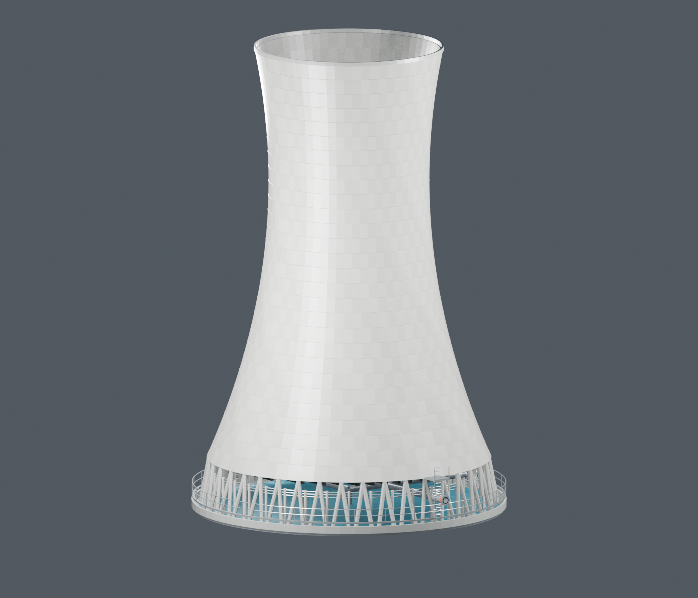
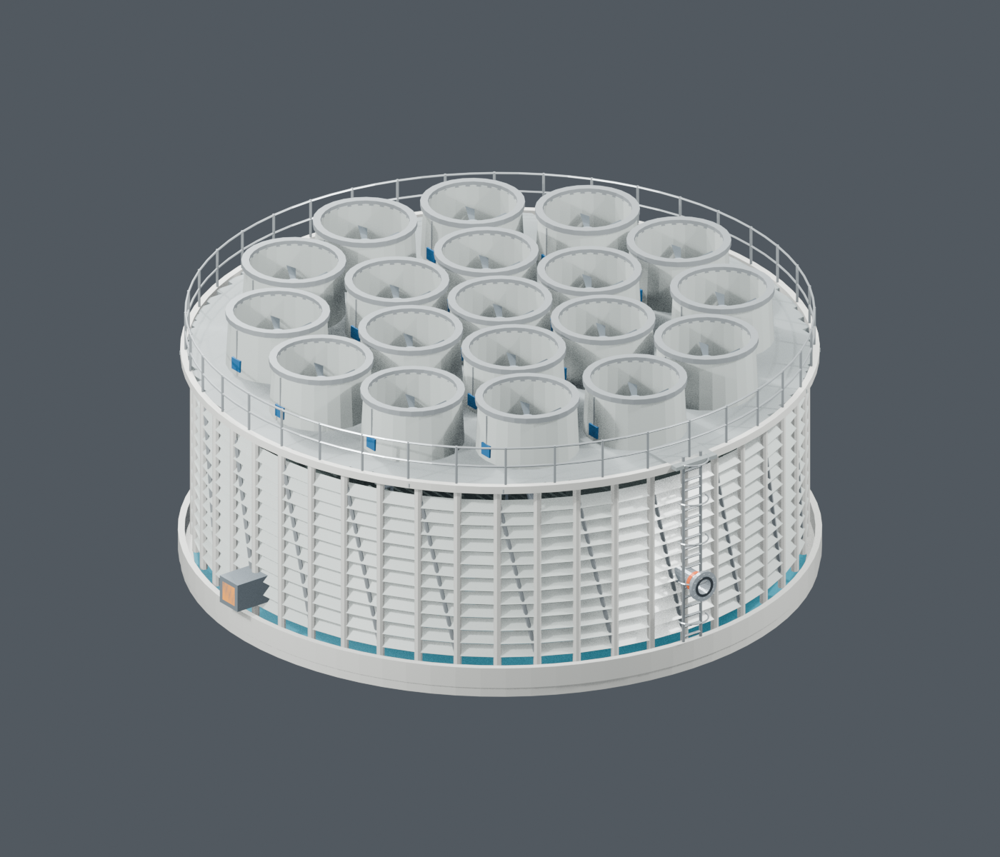
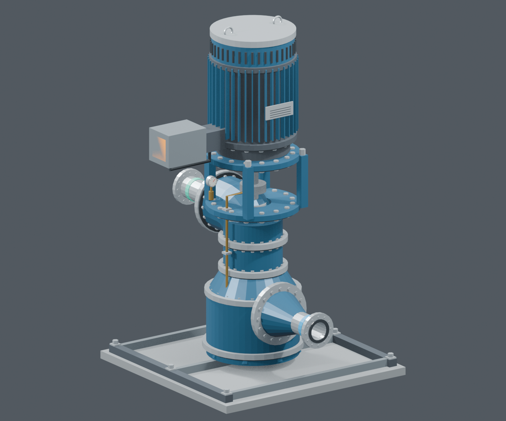
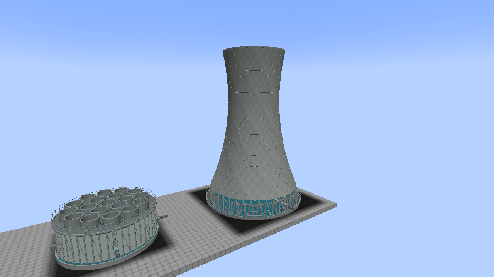
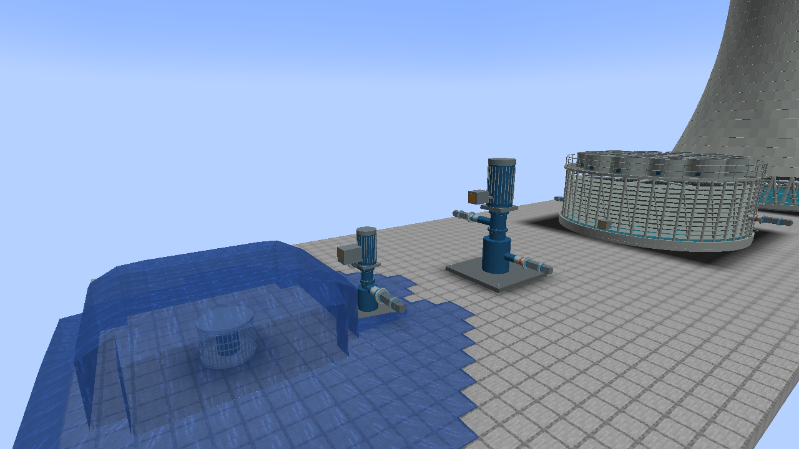
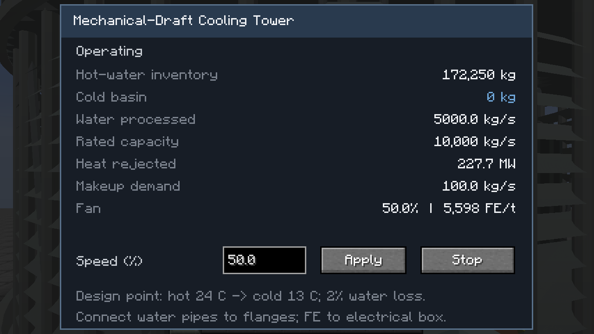
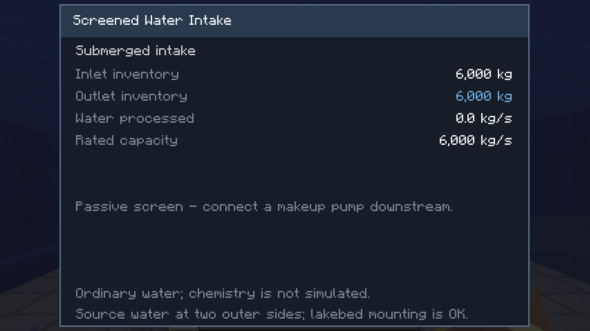
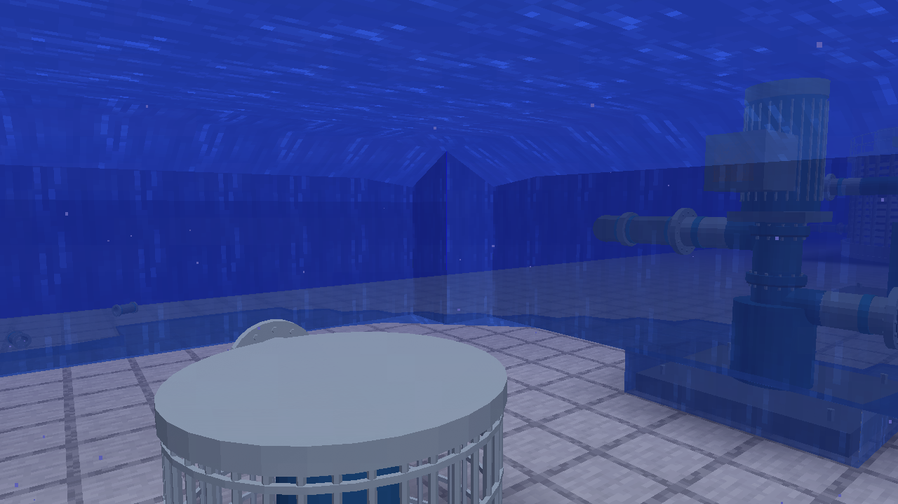
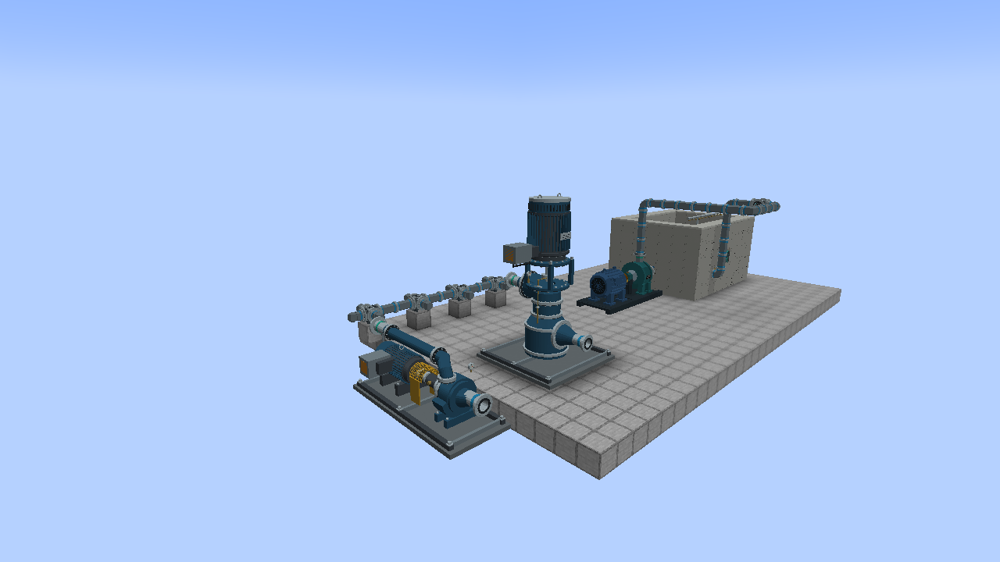

# Cooling-water system

Five placeable machines, authored in Blender. This is the condenser's separate
circulating-water circuit; it does not replace the reactor's DVSS recirculation pumps.

| Machine | Footprint W × H × D | Rated water flow | Electric rating |
| --- | --- | --- | --- |
| Natural-Draft Cooling Tower | 25 × 36 × 25 | 60,000 kg/s | None |
| Circular Induced-Draft Cooling Tower | 17 × 8 × 17 | 10,000 kg/s | 600 kW |
| Circulating Water Pump | 5 × 8 × 5 | 30,000 kg/s | 11 MW |
| Makeup Water Pump | 3 × 5 × 3 | 1,500 kg/s | 600 kW |
| Screened Water Intake | 3 × 2 × 3 | 6,000 kg/s source limit | None |

These are game design ratings, not manufacturer-certified pump curves. Dimensions
are scaled for Minecraft. One natural tower or six circular towers can process the
condenser's 60,000 kg/s design flow; two large circulating pumps provide that flow.
Use fewer machines for smaller loads. The revised circular tower has 19 animated fans. Its louvers, fan stacks,
service deck, safety rails and ladder are modeled in Blender from real tower
photographs. The natural tower now has concrete pour lines, varied panels,
braced supports, a service walkway and distribution piping. Ratings are unchanged.

## Connect the loop

```text
Condenser front hot-water outlets -> Tower hot-water inlet
Tower cold-basin outlet -> Circulating Water Pump inlet
Circulating Water Pump outlet -> Condenser rear cold-water inlets

Lake/river -> Screened Water Intake -> Makeup Water Pump -> Tower makeup inlet
                                                        -> Storage tank (optional branch)
```

Use BWR **High-Pressure Water Pipe** or Mekanism Mechanical Pipes. The cooling
machines refuse steam pipes. Do not connect hot return and cold supply to the same
pipe network. BWR water networks support up to 256 pipe blocks per connected network.
Pumps can pull from a tower basin, intake, tank, or connected fluid network. Configure
third-party pipes' push/pull behavior normally; BWR water pipes have no stored water.

Place each item at the **center of its base** with sufficient room in all directions.
Models occupy only their actual shell/support cells; each machine has one simulation
controller. Breaking any owned part removes the assembly and drops one item in
survival with the correct tool. Keep the entire footprint loaded during operation.

Ports face outward on full-block flange centers. In the default north-facing layout:

| Machine | Front / north | Rear / south | Left / west | Right / east |
| --- | --- | --- | --- | --- |
| Either tower | Hot inlet, y=2 | Cold outlet, y=1 | Makeup inlet, y=1 | FE box, y=1 (fan tower only) |
| Circulating pump | Suction, y=1 | Discharge, y=3 | — | FE box, y=5 |
| Makeup pump | Suction, y=1 | Discharge, y=2 | — | FE box, y=3 |
| Intake | — | Water outlet, y=1 | — | — |

Heights are block offsets above the placement block. Connections rotate with the
model. Use the outward face of the flange or electrical box. Only water inlets accept
water; only outlets allow extraction. Motor boxes accept FE and never supply it.

## Start and control

1. Place the screened intake in a lake or river. Its parts are waterloggable and
   retain water when placed or dismantled. Source water must touch at least two
   outer cardinal sides (two blocks from the center, at base or base+1 height).
   A solid lakebed below is valid. Flowing water, lava, and the intake’s own
   waterlogged cells alone do not count as a renewable supply.
2. Connect the makeup pump to the intake and tower makeup inlet. Supply FE, right-click
   the pump and set speed above zero. This primes the tower's cold basin.
3. Power and start the large circulating pump. Start the fan tower if used; natural
   draft needs no FE. Then supply condenser steam and drain its separate condensate outlet.
4. Right-click any machine part for inventory, flow, rated capacity, makeup demand,
   heat rejection, and motor/fan information where relevant. The passive intake
   has no motor/fan readout or controls. Powered units accept 0–100% speed in
   0.1% increments, plus a Stop button. New powered units start stopped.

The screen reports **water processed**, which may differ briefly from delivered
flow while output inventory fills. FE demand scales with the cube of speed; low
power reduces actual speed. Pumps cannot transfer at zero speed. Tower cold basins
remain available to a circulation pump when fans stop, until their stored water runs out.
Each output has one shared per-tick limit, including multiple connected consumers.

Towers return 98% of processed water. The remaining **2%** represents combined
evaporation/blowdown as an initial gameplay assumption. Makeup enters the cold basin
and does not bypass the finite storage limit. At 60,000 kg/s the makeup requirement
is 1,200 kg/s, within one makeup pump's 1,500 kg/s rating.

The intake supplies ordinary Minecraft water. Screening and water chemistry are not
simulated: it does not physically purify lake water into condensate. This water can
fill the mod's existing condensate tanks because the current game fluid is water.

## Temperature and condenser limits

Cooling still uses the existing **24°C hot return / 13°C cold supply** design point.
Heat rejection is calculated from processed mass and liquid enthalpy difference.
Temperature is not yet transported through arbitrary water pipes, so this is not a
weather, wet-bulb, fouling, or whole-plant temperature simulation.

The condenser accepts **LP exhaust and bypass steam**. An LP turbine seats six
blocks above the matching condenser’s center foundation, facing the same way.
LPs no longer condense water or expose a water outlet. Missing/full condensers
block LP flow; sustained operation needs the cooling loop and condensate drain.
Dynamic vacuum simulation remains future work. See [condenser guide](CONDENSER-AND-MSIV.md).

## CC:Tweaked

Attach a modem to any loaded assembly part. Peripheral types:

- `bwr_natural_draft_tower`
- `bwr_mechanical_draft_tower`
- `bwr_circulating_water_pump`
- `bwr_makeup_water_pump`
- `bwr_screened_water_intake`

```lua
local pump = peripheral.find("bwr_circulating_water_pump")
pump.setSpeed(0.75) -- fraction 0..1; powered machines only
print(textutils.serialize(pump.getStatus()))
```

`getStatus()` returns `ready`, `target`, `speed`, `inputKg`, `outputKg`,
`flowKgPerS`, `ratedKgPerS`, `makeupKgPerS`, `heatRejectedMW`, `energyFE`, and
`drawFEPerTick`. Control logic and interlocks remain the player's responsibility.

## Models and references

All five meshes, the separate fan rotor, Blender files, renders and authoring script
are in `art/models/cooling/`. Export with `python tools-export-cooling.py`; verify
with `python tools-export-cooling.py --check`. The revised tower authoring script
is `build_revision.py`; call `build_natural_revision()` and
`build_mechanical_revision()` in Blender. No third-party mesh was imported.
Existing towers retain their saved occupancy and ports while using the new visuals;
new placements use the revised mesh’s collision footprint.

Photo references for this revision:

- [Black & Veatch — Columbia Generating Station](https://www.bv.com/en-US/perspectives/collaboration-at-the-core-of-engineer-of-choice-role-for-energy-northwest): aerial photograph of the circular towers.
- [SPIG cooling-tower brochure](https://spig-gmab.com/wp-content/uploads/2024/11/SPIG_001_Cooling_Towers.pdf): fan decks, railings, air intakes and natural-draft structures.
- [USGS natural-draft cooling tower photograph](https://www.usgs.gov/media/images/natural-draft-cooling-tower): hyperbolic concrete shell.

These references inform original, scaled game geometry; the 19-fan model is an
artistic adaptation, not a certified Columbia construction drawing.

- [Flowserve VCT circulating-water pump](https://www.flowserve.com/products/products-catalog/pumps/vertical-pumps/wet-pit-pumps/flowserve-vct-wet-pit-pump/): large wet-pit pump reference for the motor, column and discharge arrangement.
- [Flowserve VTP vertical turbine pump](https://www.flowserve.com/products/products-catalog/pumps/vertical-pumps/wet-pit-pumps/flowserve-vtp-wet-pit-pump/): smaller general water-pump reference.
- [Columbia NRC license renewal application](https://www.nrc.gov/reactors/operating/licensing/renewal/applications/columbia/columbia-lra.pdf), section 2.4.12.3: six circular mechanical-induced-draft towers. The player selected this style.
- [SPX natural-draft tower reference](https://spxcooling.com/pdf/CL800ND-09.pdf): hyperbolic shell and open lower air inlet.
- [SPX induced versus forced draft](https://spxcooling.com/library/induced-draft-vs-forced-draft-cooling-towers/): the selected top-mounted fans pull air through the tower.





## In-game verification







## Detailed pump replacements (September 2026)



The circulating pump is an original Blender model informed by the
[Flowserve VCT circulating-pump bulletin](https://www.flowserve.com/sites/default/files/dam/documents/ps-40-6-e.pdf),
especially its sectional discharge head, column flanges and bearing arrangement.
The game uses a pipe-fed suction barrel, a five-segment discharge elbow, an open
motor stool, finned motor, bolted joints, seal piping, gauge and electrical box.
Its existing 5 × 8 × 5 envelope and flange locations are retained.

The makeup pump is a horizontal end-suction centrifugal assembly informed by
[KSB's Etanorm sectional drawing, Figure 6](https://configurator.ksbindia.co.in/GeneralUtilities/KSBDocumentation/ETANORM/ETANORM_Op_Ins.pdf).
It has a spiral volute, seal/bearing carrier, visible shaft coupling under a
perforated guard, horizontal finned electric motor, fan grille, skid anchors,
instruments and an overhead discharge header. Its new envelope is 3 × 3 × 7.
The header retains the south-facing discharge connection; suction faces north.

These are original exterior game meshes, not vendor CAD or exact rated products.
The manufacturer names identify visual references only. Editable source and
reproducible Blender script are under `art/models/cooling/revise_pumps.py`.

New placements use layout version 3. Existing version 1/2 pumps keep their old
geometry, occupied cells and connections. Break and replace an old pump to use
its new model, leaving space for the longer makeup-pump skid. Water-flow and FE
ratings have not changed. Supply water to a suppression basin through its amber
Return / Fill Port; choose regular fill or spray in the basin panel.
