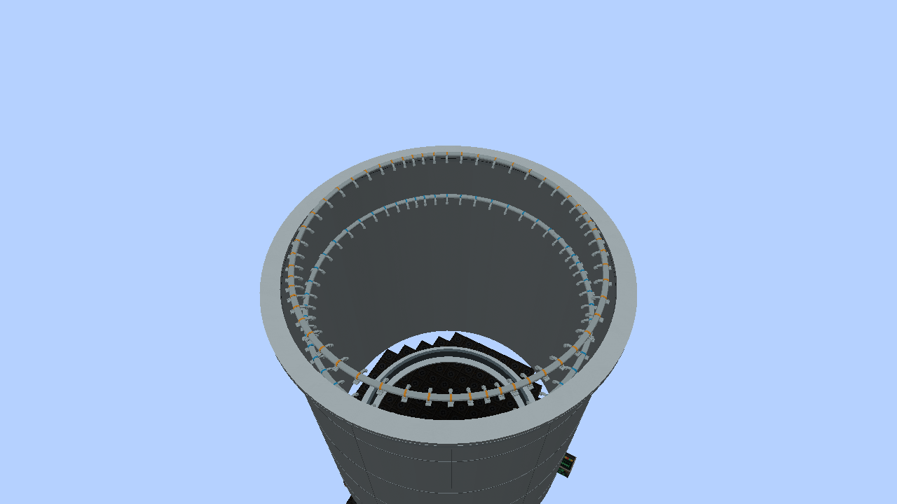
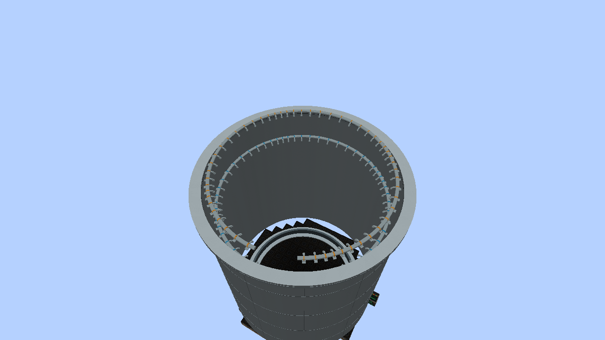

# Core-spray spargers — alpha.14

The existing **Core Spray Sparger** item now has original Blender pipework:
stainless headers, downward/inward nozzle branches, welds, recessed mouths and
mounting brackets. The user-supplied Fukushima reference GIF guides the visual
form. This is a game-scale interpretation, not a dimensionally exact replica.

## Building the rings

Keep the existing construction layout: place segments around the **inside
perimeter** of the vessel. Right-click a segment to switch its loop:

- LPCS: one block above the top of active fuel, with blue identification collars.
- HPCS: four blocks above the top of active fuel, with amber collars.

When the reactor forms, those segments display as circular rings; rectangular
vessels use elliptical rings. Their position follows the vessel, their nozzles
point inward/downward, and their pipe diameter stays fixed as the vessel grows.
Open the reactor head to see them. The construction blocks remain the placement,
interaction and collision locations, as with the assembled vessel exterior.
Outside a formed reactor, segments show their individual pipe-and-nozzle models.

Each built segment contributes one corresponding arc and nozzle. Missing
segments leave visible gaps and retain the existing proportional spray-capacity
reduction. Wrong loop elevations still fail reactor validation. Breaking the
vessel removes the assembled visual and reveals the individual segment models.

The existing core-spray delivery through reactor injection plumbing remains in
use. The internal visual nozzles do not add independent external fluid ports,
new water inventory or new spray physics.

## Rendering and compatibility

Both rings are included in the reactor's cached GPU geometry. The server records
installed segments during structure validation; normal render frames do not scan
the ring or rebuild its mesh. Geometry changes replace the cached shape through
the existing vessel snapshot and model-data invalidation path.

The item/block ID and LPCS/HPCS block states are retained. A horizontal facing
property rotates unassembled segments; old states default to north. Older
appearance snapshots without sparger data remain readable. GUI protocol is 10.

Editable source: `art/models/core_sparger/core_sparger.blend`.
Blender builder: `art/models/core_sparger/build_models.py`.
Deterministic exporter: `python tools-export-core-sparger.py`; use `--check` to
verify the exported assets without changing them.
