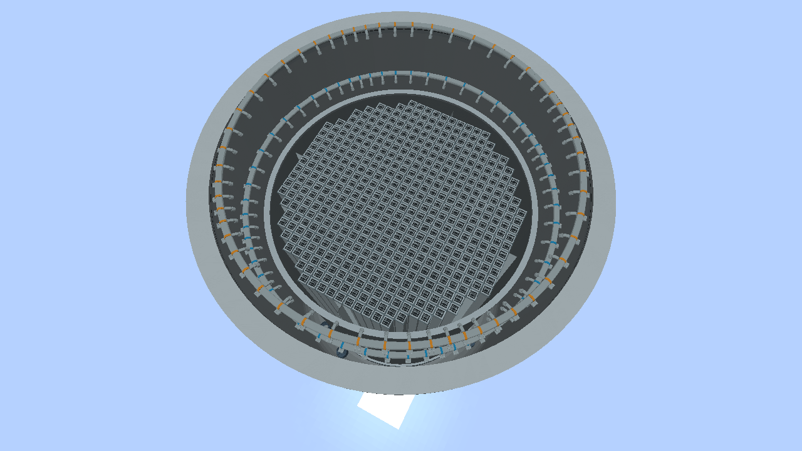
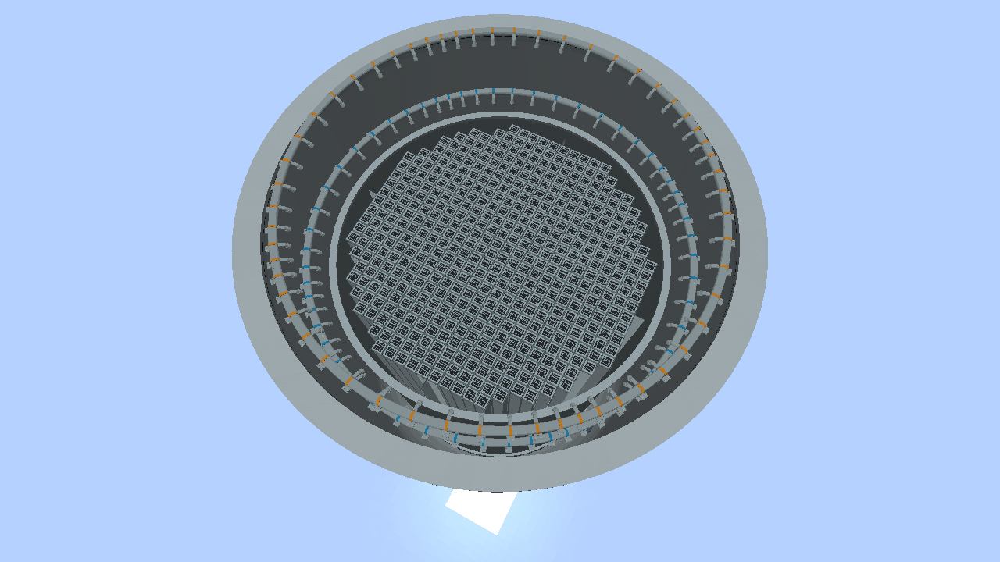
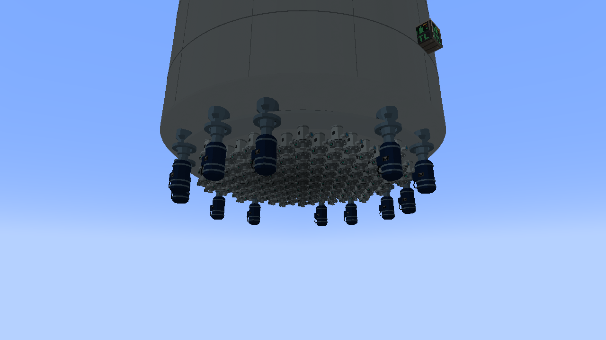
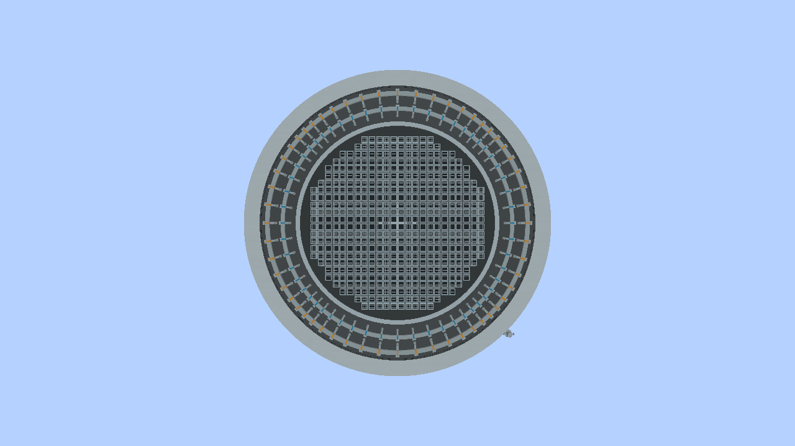

# Reactor internal pumps and hydraulic control rod drives

## Continuous core with a surrounding pump ring

Installing the first RIP selects a **smaller, continuous central core and
shroud**. The pumps occupy the annular space around that shroud. Additional
pumps use the same ring and add circulation capacity; they do not remove
individual columns from the core or shrink it again. Removing the last RIP
restores the ordinary core layout once its floor and required drives are rebuilt.

This arrangement follows the peripheral bottom-head pumps shown in the
[NRC ABWR design discussion, pages 21–24](https://www.nrc.gov/reading-rm/doc-collections/acrs/tr/subcommittee/2007/ab120507.pdf)
and the [Hitachi ABWR brochure, pages 15–20](https://www.hitachi-hgne-uk-abwr.co.uk/downloads/2016-05_abwr-brochure.pdf).
The smaller diameter is our space tradeoff inside a fixed Minecraft vessel,
not a claim that real ABWRs must have smaller cores. The brochure also describes
an enlarged ABWR shroud compared with its BWR-5 reference.

### ABWR proportions (alpha.19)

The visible barrel uses **GE ABWR DCD Tier 2, Table 5.3-2**:

| Dimension | ABWR reference |
| --- | ---: |
| Vessel inside diameter, inside cladding | 7,112.0 mm |
| Shroud outside diameter | 5,600.7 mm |
| Shroud wall thickness | 57.2 mm |
| Radial annulus, calculated from those diameters | 755.65 mm |

[GE dimensional table, printed page 5.3-21](https://citeseerx.ist.psu.edu/document?doi=349cd3b2f65f39fefba013a33fd48bec9ab985bb&repid=rep1&type=pdf).
The shroud OD is **78.75%** of the vessel ID. Each side's gap is **10.625%**
of the vessel ID, not 10.625% of the outside Minecraft footprint. Do not mix
these dimensions with the separate radiation-calculation geometry in Table 5.3-1.

The Blender vessel barrel's ID is 0.896 times its outside block width.
Consequently the displayed RIP dimensions are:

```text
shroud OD = 0.896 × outside width × (5600.7 / 7112)
radial gap = (0.896 × outside width - shroud OD) / 2
shroud wall = 0.896 × outside width × (57.2 / 7112)
```

| Outside footprint | Vessel ID | RIP shroud OD | Gap per side |
| --- | ---: | ---: | ---: |
| 7 × 7 | 6.272 | 4.9392 | 0.6664 |
| 17 × 17 | 15.232 | 11.9952 | 1.6184 |
| 23 × 23 | 20.608 | 16.2288 | 2.1896 |

Values are in blocks. Rectangular vessels apply the same proportions to each
axis; they are a game adaptation, not a real ABWR vessel shape. Flange overhang
and the small fuel-to-shroud allowance remain game-art dimensions.

The fuel channels, support cells, guides and blades expand together to fit the
larger shroud. Alpha.18's 17 × 17 shroud was only 9.68 blocks across, leaving a
2.78-block gap. That visible shrinkage was incorrectly tied to the 2 × 2 pump
construction envelopes. Those envelopes no longer set the visible diameter.
Pump wet ends are below the shroud's lower edge; a full-height cylinder around
each pump overstates the clearance needed by the rendered parts.

### Perimeter packing (alpha.20)

Alpha.19 enlarged the visible core but retained the conservative construction
mask and stretched its remaining fuel channels. Alpha.20 instead adds **real,
loadable assembly positions** around the edge and uses one shared packing result
for the simulation, Minecraft meshes and Blender review.

The packing checks the outer corners of each square fuel/support cell against
the shroud's inner ellipse. It leaves a 2% radial allowance for the fuel grid;
this is a game clearance, not a claimed manufacturer tolerance. Additional
blades are admitted only when their cruciform wings and lower guide fit. A
complete four-bundle cell always has an unobstructed physical drive; partial
peripheral groups may have one to three bundles around their blade. The outermost
uncontrolled positions continue to use the existing peripheral-fuel simulation.

RIP blocks still occupy 2 × 2 floor footprints. That construction constraint is
why the count remains below an ordinary core, even though the rendered shroud
has much less shrinkage. More capacity beyond this packing would require a
change to the pump footprint or drive arrangement. Alpha.20 fills available
perimeter orbits symmetrically without creating holes, losing existing slots,
or compressing the bundles below the ordinary core's pitch.

| Outside footprint | Available RIP mounts | Fuel without RIPs | Fuel with any RIPs | Drives with RIPs |
| --- | ---: | ---: | ---: | ---: |
| 7 × 7 | 4 | 88 | 40 | 5 |
| 17 × 17 | 12 | 764 | 476 | 109 |
| 23 × 23 | 16 | 1,476 | 1,084 | 253 |

A 17 × 17 vessel has 476 available fuel positions with one RIP or twelve.
Height affects circulation demand, not fuel count or the floor mount count.
The ABWR shroud proportions from alpha.19 are unchanged. These capacities are
Minecraft packing results, not the assembly counts of a real ABWR.

## Install a RIP

Internal pumps join a compact reactor through defined **2 × 2 bottom-head
mounts**. They circulate water already inside the vessel and need no external
water loop or jet assemblies. They need FE and a player-selected speed/start
command.

1. Shut down, cool and unload the peripheral fuel that the smaller core excludes.
   Defuelling the entire core first is the simplest conversion route.
2. While the vessel is still formed, hold a **Reactor Internal Pump** item.
   Cyan outlines show available mounting envelopes. Mark sites before opening
   the bottom shell, because an unformed vessel has no placement guide.
3. Remove the four bottom-shell blocks at a chosen mount and the CRDs below
   them. Clear a **2 × 2 × 5** envelope: the flange occupies shell level, the
   motor extends three blocks below, and the wet end occupies the first
   interior level.
4. Place the RIP with its controller at flange level. All four horizontal
   facings work when the complete 2 × 2 footprint occupies the marked site.
   The pump replaces those four shell blocks. Restore any other floor openings
   and keep the required central CRDs. The reactor revalidates automatically.
5. Salvage unused outer CRDs if desired. They are no longer part of the active
   core; the game does not delete the player's extra blocks automatically.
6. Connect FE to an exposed pump face. Right-click a part, set speed and press
   **Start**. The panel must report **Mounted inside reactor vessel**.
   CC:Tweaked can use exposed assembly faces when computer control is selected.
   No automatic start, trip or speed controller is added.

Incomplete pumps and invalid mount locations prevent formation. Breaking an
operating assembly withdraws its flow contribution and disconnects cached FE
access. Unloaded chunks do not count as intact hardware.

### Upgrading an alpha.18 or alpha.19 RIP installation to alpha.20

All existing fuel slots and drives are retained. Pump positions do not move.
Existing **17 × 17** RIP cores need **eight additional CRDs** under these
interior-relative X/Z offsets, one block below the vessel floor:

```text
(1,7) (2,4) (2,10) (7,1) (7,13) (12,4) (12,10) (13,7)
```

The controller reports missing drive coordinates until they are installed.
A **23 × 23** RIP core needs twelve additional drives; the minimum 7 × 7 needs
none. Saved fuel and transient state are retained while the structure waits for
the drives. New drives begin fully inserted and with empty accumulators; supply
water and power to their connected group. Existing drives retain their actual
positions and pending demands. **Refresh cached numeric rod IDs** in CC scripts
with `getCoreLayout()`, since the raster order gains peripheral entries.

The 17 × 17 core gains 32 fuel slots; the 23 × 23 gains 48. Load the extra slots
through the existing refuelling controls. The 7 × 7 gains 16. Ordinary cores
without RIPs are unchanged. Shut down the reactor before rebuilding its hardware.

### Historical alpha.17 → alpha.18 upgrade

Alpha.18 moves only the most restrictive pump sites, by at most one block on
each horizontal axis. The larger core keeps every previously allowed fuel
position. In a 17 × 17 vessel, **four diagonal sites move** and the other eight
stay in place. Follow the coordinates above or mark the revised held-item
outlines before opening the bottom head. Fill the old openings, reposition the
affected pumps, and add the newly required central drives; the controller names
any missing CRD coordinates. Numeric rod IDs can change as four drives are added.
Saved fuel and surviving drive state are retained.

The 17 × 17 core grows from 408 to 444 assemblies and the 23 × 23 core from 964
to 1,036. The smallest core stays at 24 because its four pumps already occupy
the available ring clearance. Pump counts, dimensions and flow ratings remain
the same. No clearance is reduced and there are no holes in the enlarged core.

### Upgrading an alpha.16 RIP installation

The old rectangular mounting pattern has changed to a peripheral ring. Move
existing pumps to the new sites; the old holes through the fuel map are gone.

If the old installation cannot form, first remove its RIPs and restore the
ordinary vessel floor and CRDs. This recovers a valid full-core layout from
which the saved fuel can be unloaded. Then follow the conversion steps above.
Removing the controller also uses the existing fuel-recovery path.

Conversion never silently deletes loaded fuel or specialty inserts. If a
removed peripheral position is occupied, formation is refused with a diagnostic.
Surviving rods retain their positions, accumulator charge and pending commands,
including across save/reload. Restored outer drives start fully inserted with
empty accumulators. Refresh cached numeric rod IDs with `getCoreLayout()` when
switching between ordinary and RIP cores; moving or adding pumps within an
existing RIP ring does not change the core map. Feed water and FE to every
connected CRD supply group if other construction splits that group.

Existing version-1 reactors retain their legacy rim-mount rules. Ordinary
compact reactors without RIPs keep their previous fuel capacities.

## Capacity and power

One full-speed powered RIP contributes **three normal jet-assembly equivalents**
of core flow (about 3,275 kg/s). Four RIPs can supply the smallest vessel's
twelve-equivalent circulation target. Larger or taller vessels need more flow;
the INFO tab shows installed RCP/RIP counts and the full-flow estimate.

Volume-based sizing, FE limitations, speed ramp and coastdown remain in effect.
Total forced flow is capped at the vessel target. External RCP loops can
supplement RIPs. A tall vessel can require more capacity than its floor mounts
alone provide. RIP capacity is a game balance value, not a manufacturer curve.
This geometry correction does not add a new thermal-MW calibration; actual
power still follows the existing core simulation and fuel loading.

## Exact coordinates through CC:Tweaked

For a formed compact vessel:

```lua
for _, mount in ipairs(reactor.getInternalPumpMounts()) do
    print(mount.x, mount.y, mount.z, mount.capacityKgPerS)
    print(mount.coreDiameterRatio, mount.coreAreaRatio)
end
```

Each result gives the **lower-X/lower-Z corner** of a 2 × 2 flange at shell-floor
height, plus `width`, `depth`, `clearanceBelow`, `capacityKgPerS`,
`coreDiameterRatio` and `coreAreaRatio`. It describes available sites, including
occupied ones. The ratios are retained for compatibility and describe the conservative seed
mask. They are neither the rendered shroud dimensions nor the final alpha.20
packing capacity. Read `getCoreLayout()` for actual fuel positions and drives. This corner is not always the controller coordinate: north-facing
pumps use it, while rotating shifts the controller to another corner of the
same footprint. Unformed and legacy version-1 reactors return an empty list.

For a **17 × 17** vessel, add these offsets to the interior's northwest corner
and use the bottom shell's Y coordinate:

```text
(0,5)  (0,8)  (3,1)   (3,12)  (5,0)  (5,13)
(8,0)  (8,13) (10,1)  (10,12) (13,5) (13,8)
```

Use the query or held-item outlines for other sizes.

## Blender sources and Columbia CRD reference

The reduced core and peripheral pump arrangement were assembled and reviewed in
Blender using the same layout data as the game:

- `art/models/reactor_core/reactor_core_rip.blend` — minimum, reference, maximum
  and rectangular review scenes.
- `art/models/reactor_core/ExportRipLayouts.java` — exports the authoritative
  core masks and mounting geometry to `rip_layouts.json` after compiling core.
- `art/models/reactor_core/build_rip_review.py` — builds the Blender scenes from
  that data and the existing authored core and pump meshes.

The dedicated `abwr_shroud.blend` pieces are rebuilt by `build_abwr_models.py`
from the dimensions exported by `ExportRipLayouts.java`. Runtime uses these
Blender pieces and cached GPU geometry. This patch adds no per-frame topology search or new block tickers.

The hydraulic CRD exterior from alpha.16 references Columbia FSAR section
**4.6.1.1.2**, Figures **4.6-2 / 4.6-3**, PDF pages **2032 / 2033**. It includes
a cylinder housing, bolted flange, paired hydraulic connectors and lower
position-indicator housing. See the [reference index](COLUMBIA-CORE-REFERENCE.md).
Columbia is the CRD reference; its reactor does not provide the RIP ring layout.

The CRD is an original game model compressed into one block, with 1,052 triangles.
Water, FE, CC access and adjacent-drive supply sharing remain functional. It uses
NeoForge's chunk-baked OBJ loader with no additional renderer, entity or ticker.
Source: `art/models/control_rod_drive/control_rod_drive.blend`; rebuild using its
`build_models.py`, then `tools-export-control-rod-drive.py`. Use `--check` to
verify shipped assets.

## Reviewed Minecraft views








