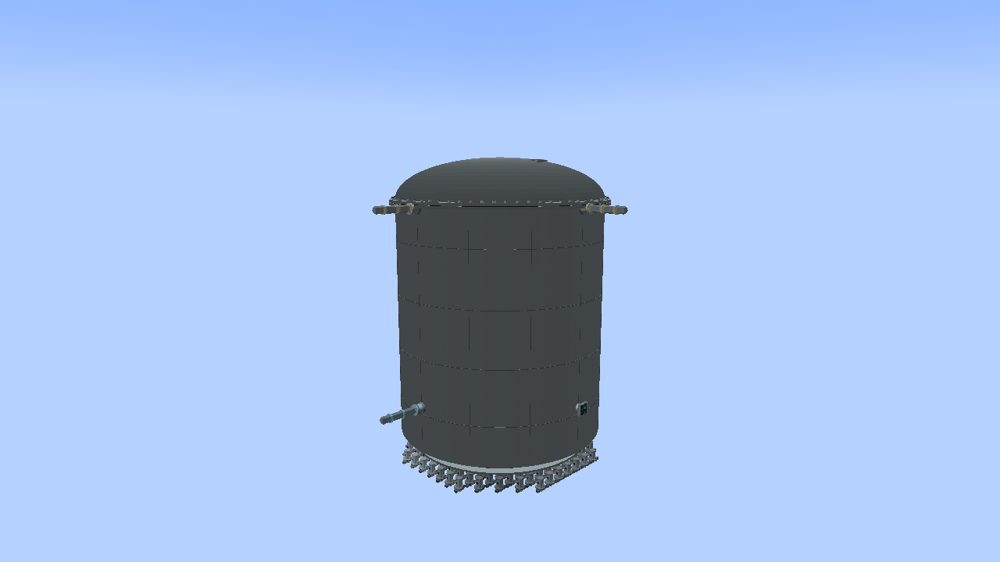
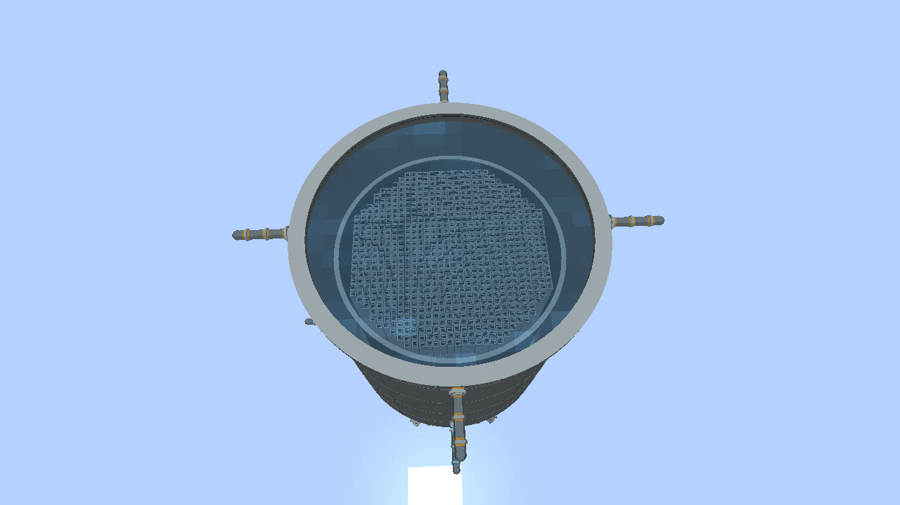

# Reactor Visual Update — alpha.21

## Vessel interfaces

Build the vessel with the existing controller, steam outlet and water inlet
blocks. Once formed, their cubes are hidden and the vessel renderer supplies
a shallow instrument panel and round, reinforced pipe nozzles. Recirculation
inlet/outlet blocks use the same integrated water nozzle. Right-click the
controller location to open its GUI; CC:Tweaked access stays at that block.
No existing plumbing, saved controller, or inventory needs replacing.
Water ports must still face outward. An incorrectly oriented water port keeps
its construction-block appearance so the new model does not imply a valid connection.

The steam and water flange ends stay at the centres of the original outward
block faces. Pipes still attach to those faces. Off-centre penetrations get
an adapter from the round shell to that exact connection, rather than silently
moving a player's pipes. The rectangular construction/collision envelope remains.
Breaking the pressure boundary restores the construction blocks until repaired.

The steam nozzle silhouette is an original Blender interpretation of the
reinforced side outlet shown in **Columbia FSAR ML23346A215, PDF page 1940,
Figure 4.1-2 (Steam Dryer Panel)**. This is a game-scale model, not a dimensioned
engineering reproduction. Source assets and reproducible authoring script:
`art/models/reactor_vessel/rvu_interfaces.blend` and `build_interfaces.py`.

## Head-off water

The server sends actual two-phase free-surface level and whether liquid exists
in the vessel, alongside its existing four-times-per-second visual updates.
Reference-leg instrument error does not move the visible water. An empty
vessel has no water surface, and a closed head hides the water draw.

The visual vessel compresses real internals vertically. The water mapping
therefore anchors bottom/top of active fuel to the rendered fuel boundaries,
maps the lower plenum separately, and clamps overfill inside the head flange.
The disk follows the circular/elliptical inner wall and lower dish. It is a
visual surface, not placeable or scoopable Minecraft water.

Level changes interpolate on the client. Only a 64-segment translucent surface
is emitted; static steel/core GPU meshes keep their cache keys. There are no
additional ticking ports, water blocks, or pipe topology rebuilds.

## Fuel choices

- **Intermediate enrichment:** 2.70% (`uranium_27`).
- **High BWR enrichment:** 3.50% (`leu`, still low-enriched uranium).
- The 1.20%/1.40% steps are retired from creative/fabricator choices. Saved
  rods retain enrichment, fuel type, burnup, mass and absorber history.

These are the project owner's chosen mod grades. The earlier BWR/6 training
manual map labels categories but does not establish these exact percentages.

Install alpha.21 on both client and server for the added appearance fields.
The gameplay GUI wire protocol remains unchanged.

## In-game previews





## Verification commands

With Java 21 configured:

```text
gradlew check :mod:runTurbineGameTest :mod:jar
gradlew :mod:runTurbineModelCheck -PbwrRvuCheck
python tools-export-reactor-vessel.py --check
python tools-check-vessel-geometry.py
python tools-check-jar.py
```

The client check creates a disposable world and captures the exterior,
full/low/empty water levels, broken vessel and repair. It checks model hiding,
water sync and stable GPU mesh uploads. It does not open player saves.

Verified on 2026-09-27: all 215 core acceptance tests and all 65 NeoForge
GameTests passed. The RVU client check passed all six capture stages and the
17-grade/eight-specialty catalogue check. Static mesh uploads stayed at four
through full, low, empty, broken and repaired states. All 33 exported vessel
assets and the JAR dependency/license checks passed.
