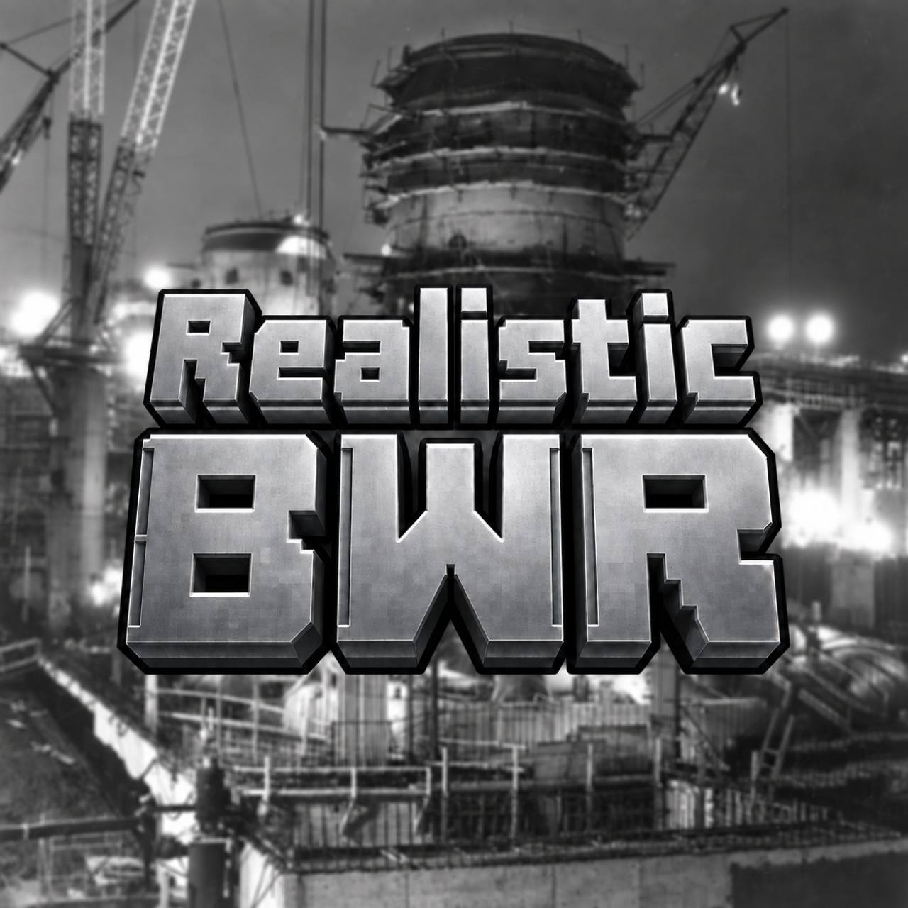
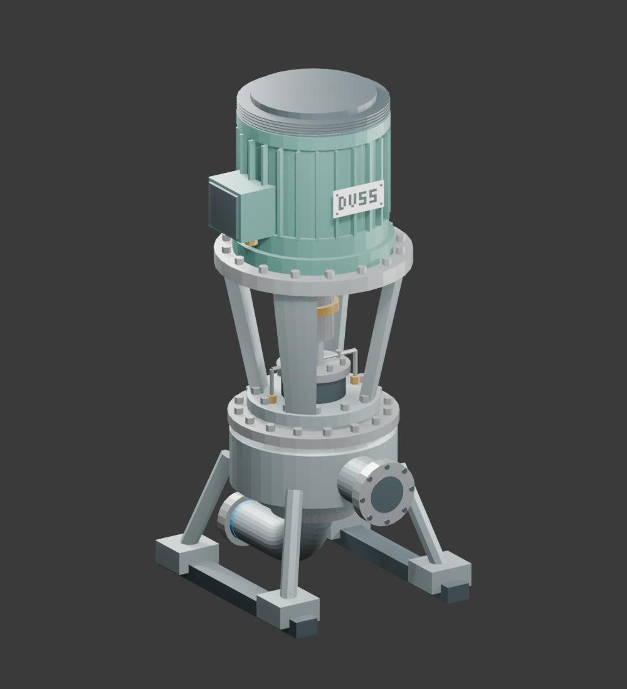

# Realistic BWR

<p align="center"></p>

**By [OldGunslingerWildBill](https://github.com/OldGunslingerWildBill)**

A working **Minecraft 1.21.1 / NeoForge** mod that adds a physically modeled
boiling water reactor, modeled pumps, and connected steam and water systems.
Power emerges from neutronics: move the control rods and change recirculation
flow, and the reactor responds. There is no commanded burn rate.

**Current version:** `0.1.0-alpha.14` — generic relief controls and modeled core spargers, September 26, 2026.

See the [full changelog](CHANGELOG.md) for the hardware, performance, condenser,
fuel and irradiation updates.

| Platform | Required version |
| --- | --- |
| Minecraft | 1.21.1 |
| NeoForge | 21.1.248 |
| Java | 21 |
| Optional integrations | Mekanism and CC:Tweaked, installed separately |

Core-spray segments now display as scaled circular headers with modeled nozzles
inside formed reactors. The former ADS items are named **Pressure Relief Valve**
and **Division**, with a **1–4** panel selector. Existing saves and CC programs
keep their registry IDs and peripheral types. See [core spargers](CORE-SPARGERS.md).
Large machine exteriors reuse GPU meshes, with separate fan animation and
full-machine visibility checks. See [machine rendering](MACHINE-RENDERING.md)
for scope, cache behavior and the repeatable client comparison.
Cooling-tower vapor follows smooth random gusts and wind that varies with
height, moving between upright columns and winding, drifting plumes.
The preceding update rebuilt RCIC and HPCI as original Blender turbine/pump skids
with round steam/water flanges, visible computer panels and dedicated GUIs.
See the [Terry turbine connection and migration guide](TERRY-TURBINES.md).
The plant also includes enclosed suppression tanks with dedicated steam inlets,
measured steam heating, corrected cooling-tower fans and tall drifting vapor.
The plant includes pumped tank filling and spray, Blender circulating/makeup pumps, physical RHR heat
exchangers, rounded pressure vessels, and compact logical fuel layouts
(764 assemblies in a 17 x 17 vessel), cooling towers, waterlogged intakes and
automatically assembled cylindrical condensate tanks. Modular HP/LP turbine
trains now exhaust to a separate condenser with bypass and cooling-water ports.
**Turbine admission is controlled at the upstream valve.** Pump, ownership,
inventory and chunk-lifecycle fixes include permanent regression checks.

**Fuel update:** a separate **Realistic BWR: Fuel & Rods** creative tab contains
19 fuel grades and eight specialty rods, with new Blender-rendered PNG icons.
Uranium ranges from natural uranium through 20%; MOX, plutonium and thorium
have lean/standard/rich variants. Fixed absorbers, startup sources and simple
irradiation targets use the existing refuelling map. Original fuel tuning and
exposure are preserved. See [fuel grades, recipes and reference notes](FUELS-AND-RODS.md).
Experimental grades are labeled; natural uranium is not self-sustaining in this
BWR model. Specialty irradiation now takes 24–168 operating hours at rated
local flux. A completed tritium rod yields 1,250 samples, processable into
12,500,000 mB (12,500 buckets) of tritium through a powered Chemical Oxidizer when Mekanism and
Mekanism Generators are installed. Install
alpha.14 on both client and server; GUI protocol remains 10.

The first-publication candidate adds live CC:Tweaked faces across the machine
registry, segmented water temperatures, condenser backpressure that affects LP
work, event-invalidated pipe routing, and batched GUI rendering. All five R01–R05
re-audit findings now have repairs and regression coverage. See the
[transport, computer and performance guide](PLANT-TRANSPORT.md) and the
[verification re-audit](PHASE-ONE-REAUDIT.md).

Source is publicly readable under the custom
[Realistic BWR Source-Available License](LICENSE). Modified redistribution
and copying code/assets into another project require written approval, subject
to the preserved rights for earlier MIT/MPL releases. Permitted redistribution
must credit **OldGunslingerWildBill**. See [license and credit](#license-and-credit).

## What is implemented

- **Rebuilt RCIC/HPCI turbine pumps:** Terry GS-inspired RCIC (5 × 4 × 5 blocks)
  and C-frame-inspired HPCI (7 × 5 × 5 blocks), listed as width × height × depth.
  Four round flanges separate steam admission/exhaust from water suction/discharge.
  Dedicated panels show speed, steam consumption, water flow, pressures,
  inlet temperature and world coordinates for every connection. Existing
  installed CAD assemblies keep their size and plumbing until replaced.
- **Physical SLC and relief hardware:** Blender-built boron solution tank and
  powered SLC injection pump, Division cabinet and modeled Pressure Relief Valve.
  SLC consumes finite borated solution through real piping into an RPV water
  inlet or a feedwater cross-tie. Divisions have local, redstone and
  CC:Tweaked commands. A new water discharge port provides a plant outfall.
  See [connections, controls and migration](ALPHA-HARDWARE.md).
- **Fast creative inventory:** complex machines use Blender-rendered inventory
  icons while preserving their full placed and held models. The actual BWR
  creative-tab slowdown was reproduced and corrected.
- **Concrete suppression basins:** player-built enclosed tanks with steam inlet flanges, modeled concrete
  walls and rims, directional suction/return flanges, and automatic formation.
  New concrete pools start empty and must be filled through pipes. A live water
  surface follows inventory. Choose **regular fill** or **tank spray** in
  the panel or with CC `setFillMode("fill"/"spray")`. Spray consumes supplied
  water and condenses steam within its finite heat-absorption limit.
  Pools also cool naturally toward 25 C over time, without power or makeup
  water; the panel reports natural heat loss separately from RHR cooling.
  LPCI/RHR pumps connect directly for injection or circulation, or through a
  Blender-built **four-port heat exchanger** with a separate cooling-water
  circuit. Direct circulation does not provide free cooling. See the
  [construction and RHR plumbing guide](SUPPRESSION-BASIN.md).
- **Phase-one reliability fixes:** fuel recovery when a controller is removed,
  exclusive reactor and suppression-basin ownership, persistent basin water,
  protected multiblock placement/mining, reconnecting machine ports, hardware-based
  recirculation commands, shared steam-valve accounting and live fuel-definition
  reload. See [all 13 fixes and existing-world behavior](PHASE-ONE-FIXES.md).

- **Condenser cooling-water loop:** Blender-built natural-draft and Columbia-style
  circular induced-draft towers, circulating and makeup pumps, and a screened
  lake/river intake. Waterlogged intake parts retain surrounding water and allow
  lakebed mounting. The circular tower has 19 animated fans, detailed louvers,
  rails and service access; the natural tower has revised concrete/support detail.
  The circulating pump now has a detailed VCT-inspired exterior; the makeup
  pump is a horizontal centrifugal assembly with a guarded coupling and finned
  motor. New makeup pumps occupy **3 × 3 × 7 blocks**.
  Finite reservoirs, 2% makeup loss, FE-driven motors/fans,
  animated fans, local speed controls and CC peripherals. See the
  [cooling-water build guide](COOLING-WATER.md) for sizes, ports and capacities.
- **Condenser and steam bypass:** a closed, Blender-built **7 x 6 x 9** condenser
  fitted beneath one LP turbine, with one upper front bypass-steam inlet, two
  front hot-water outlets, two rear cold-water inlets, a separate condensate
  outlet and two round side makeup-water inlets feeding the hotwell. Hold the condenser and click the LP turbine's underside to snap it
  into place: green outline means it fits, red means it is blocked. Manual
  foundation placement also works, with the LP six blocks directly above and
  with the condenser facing 90 degrees clockwise from the LP. Main piping faces
  the hall sides; adjacent seven-block LP modules each fit a condenser. Old
  condenser sizes and orientations remain intact until drained and replaced.
  A modeled bypass
  valve provides 0-100% local and CC control. See the
  [port, cooling-supply and CC guide](CONDENSER-AND-MSIV.md).
- **Modeled MSIV:** a Blender-built three-block isolation valve with opposed
  steam flanges, redstone/CC control and a four-second full closing stroke.
  Connect an FE cable to an exposed non-steam face; opening draws 100 FE/t and
  holding open draws 20 FE/t. The spring closes when stored power runs out.
  CC modems work on every exposed part. Existing cube valves retain their
  footprint and also require FE. See
  [MSIV placement and condenser guide](CONDENSER-AND-MSIV.md).
- **Steam valve control:** placeable Blender-built stop and fine control valves
  regulate a common header feeding multiple HP turbines. HP exhaust supplies
  the LP sections. Valve panels provide Open/Close and 0.1% adjustments; turbine
  panels report operating data. See [steam valves and migration](STEAM-VALVES.md).
- **Modular main turbine trains:** Blender-built TX-10-style HP and LP sections
  and a TX-NLCH-style generator. Aligned end shafts join; steam is piped between
  sections independently. LP exhaust discharges into a matching condenser below it;
  water is collected at the condenser, not the LP turbine.
  Turbine panels and CC readouts report flow, pressure, temperature estimates,
  shaft speed and power. Each generator supports up to 1,500 MW electrical.
  See [the turbine build guide](MODULAR-TURBINES.md) for connections, dimensions
  and condenser placement.
- **Reactor physics:** delayed-neutron kinetics, rod worth, spatial flux, void
  and temperature feedback, xenon, fuel burnup, decay heat, vessel inventory,
  pressure, and damage modeling.
- **Continuous rod travel:** power and SRM period respond while rods move
  between notch positions. Mid-travel positions survive saves; outages hold the
  physical position, and reversal and scram start from it.
- **Reactor screens:** operating instruments, fuel/flux information, and an
  **INFO** tab with loaded bundles, jet matching, installed flow capacity, live
  thermal/steam output, and labeled planning estimates.
- **Volume-based recirculation:** width, depth and height determine the flow
  target. Each external recirculation pump supports ten normal jet assemblies;
  additional jets stop increasing flow at the drive limit. INFO shows the targets.
- **Placeable pump models:** Terry RCIC, HPCI, HPCS, LPCS, RHR/LPCI, electric and
  turbine feedwater, internal recirculation, jet assemblies, and a Blender-built
  DVSS-style external recirculation pump.
- **Modern pump connections:** centered round flanges on HPCS, LPCS, RHR/LPCI,
  and both feedwater pumps, with odd-width footprints and larger RHR/feedwater
  bodies. These models and the new pipe fittings are authored in Blender.
- **Pump controls:** right-click a powered pump for numerical 0–100% speed,
  Start/Stop, flow, pressure, and available temperature/supply information.
  Manual, redstone, and computer modes are available where supported.
- **Scalable condensate tanks:** cylindrical Blender models, 3–15 block odd
  diameters and 3–24 block heights. Build a complete box of tank blocks with a
  floor, walls and roof; it automatically becomes a cylindrical tank. Capacity
  follows volume, and formation preserves the placed blocks’ combined water. Four side flanges connect to water pipes and pump suction.
  Existing single-block tanks retain their saved water until converted.
  Breaking a formed tank restores recoverable casings; drain it before dismantling.
  See the [tank construction guide](CONDENSATE-TANK.md).
- **Rounded pressure vessel:** a Blender-built steel barrel, bolted flange and
  domed head appear when the reactor forms. Ports stay at their placed locations.
  The rectangular construction/collision boundary remains; holding a vessel
  block shows its outline. See [vessel appearance](PRESSURE-VESSEL.md).
- **Separate pipe systems:** High-Pressure Water Pipe for water and High-Pressure
  Steam Pipe for steam. Electric pumps use FE and have no steam-drive ports.
  BWR pipe segments have no tickers. Machine transfers use an event-invalidated,
  compressed connection graph; unchanged pipe networks are not rescanned each tick.
- **Dyeable round pipes:** swept elbows, junctions and coupling rings. Right-click
  with any of the 16 vanilla dyes to color the identification bands. Color is
  cosmetic; water and steam stay separate.
- **Integrations:** Mekanism water/steam connections and CC:Tweaked faces on
  machine controllers and modeled assembly parts, including condensers and RHR
  exchangers. Modems resolve the live owner after reload. Both mods are optional.
- **Segmented water temperatures:** buffers mix incoming mass and energy; BWR
  water pipes carry enthalpy without ticking or storing fluid per segment.
  Condenser vacuum/backpressure now affects LP work. See
  [transport and its compatibility limits](PLANT-TRANSPORT.md).
- **Faster menus:** fuel cells and screen readouts are drawn in batches. Local
  reactor-menu measurements improved from 109 to 205 FPS at 764 assemblies;
  modpack performance still depends on the client and scene.

The mod provides hardware and physics. The player provides control logic:
automatic trips, ECCS actuation, and protection sequences are not built in.
Manual controls and the scram actuator remain available.

The condenser receives **LP exhaust and reactor bypass steam**. Cooling and
condensate inventories are finite and separate. Water temperatures propagate
between BWR buffers; condenser backpressure responds to coolant temperature and
steam accumulation. The cutaway is an inspection asset;
the in-game machine retains its shell panels.

## Build a working steam plant

```text
RPV steam outlet
  -> Steam Stop Valve -> Turbine Steam Control Valve -> HP inlet header
                                                          |       |
                                                         HP      HP
                                                          |       |
                                                          +---+---+
                                                       crossover header
                                                         | | | |
                                                        LP LP LP LP
                                                         | | | |
                                                   condensers below LPs
                                                         | | | |
                                                    condensate return
                                                          |
                                        storage tank -> feedwater pump
                                                          |
                                                RPV Water Injection Port
```

1. Place turbine sections and a generator with **touching, aligned end shafts
   at the same height**. Each module is one large placeable object. Steam pipes
   connect the sections separately from the shafts.
2. Feed the HP top inlets through a common steam header. Place the stop and
   control valves before the branch if one valve should control all HP sections.
   Use **High-Pressure Steam Pipe** at steam ports.
3. Pipe HP side exhausts into LP top inlets. Put one compact condenser **six
   blocks directly below each LP placement block**. Snap it by clicking the LP
   underside; its front faces 90 degrees clockwise from the LP. Supply
   its cold-water inlets, remove hot cooling water, and route its separate
   condensate outlet to storage or feedwater suction. Use **Mekanism Mechanical
   Pipes** or BWR water pipes. A powered makeup pump can feed either round side
   hotwell inlet; this water stays separate from circulating cooling water.
   Return feedwater through an RPV Water Injection Port.
4. Connect an energy consumer or storage to the generator's **copper terminal**.
   A full energy buffer, full condensate buffer or blocked exhaust limits flow.
5. Right-click the valves: **new valves start closed**. Open the stop valve,
   then adjust the control valve in **0.1% steps**. HP/LP panels report operation;
   they no longer have local admission settings or Start/Stop buttons.

| Module | Width × height × length | Game capacity |
| --- | --- | --- |
| TX-10 Style HP Turbine | 5 × 5 × 9 | Up to 2,200 kg/s |
| TX-10 Style LP Turbine | 7 × 5 × 7 | Up to 750 kg/s |
| TX-NLCH Style Nuclear Generator | 5 × 5 × 9 | Up to 1,500 MW electrical |

Valve opening controls steam supply, not a fixed electrical power percentage.
HP sections share that supply, and LP sections consume their actual exhaust.
Stored downstream steam can continue expanding briefly after the stop closes.
The stop valve takes 0.5 seconds for a full stroke; the control valve takes two.

LP sections now require an external condenser. Missing or full condensers stop
LP exhaust flow; cooling supply and condensate drainage are needed for sustained
operation. Legacy LP water is moved into its matched condenser without loss. A
moisture separator/reheater remains future work. Steam temperatures are saturation
estimates; water enthalpy is preserved within BWR networks, with third-party
component-handling limitations. These are game-scale models,
not manufacturer performance simulations.

See [steam valves and their CC API](STEAM-VALVES.md) and
[modular turbines](MODULAR-TURBINES.md) for the full connection and operating guide.

## Reactor size limits

These dimensions describe the **vessel**, excluding external pumps and piping.

| Dimension | Interior | Outside, including the one-block shell |
| --- | --- | --- |
| Width and depth | 5–21 blocks each | 7–23 blocks each |
| Minimum height | 8 blocks | 10 blocks |

**Maximum footprint: 23 × 23 blocks outside (21 × 21 inside).** Rectangular
footprints are supported within those limits; fuel, rod-drive, and closed-shell
requirements still apply.

Height has no separate configured maximum, but the validator must find the
bottom and top shell within **64 blocks in each direction** from the interior
position beside the controller. With that position centered vertically, this
implies a code-derived upper bound of **127 interior blocks / 129 outside**.
A controller near the bottom allows less height. The tallest configuration has
not been tested in-game; this is a validation bound, not a tested performance
rating. Minecraft build-height limits also apply.

The limits are defined in
[`ReactorStructure.java`](mod/src/main/java/dev/bwr/mod/reactor/ReactorStructure.java).
Larger geometry does not by itself promise proportionally greater thermal power;
the INFO tab distinguishes live output from configuration estimates.

## Compact fuel and control rods

New reactors simulate individual fuel assemblies independently of Minecraft
blocks, with one physical CRD below the floor for every blade.

| Outside vessel footprint | Fuel assemblies | CRD blocks |
| --- | ---: | ---: |
| Minimum 7 × 7 | 88 | 21 |
| Reference 17 × 17 | **764** | **185** |
| Maximum 23 × 23 | 1,476 | 357 |

The reference matches the requested Columbia counts using a symmetric game
layout. Every blade shadows four local bundles, with additional peripheral
fuel. GUI maps, physics and CC use the same stable layout. Face-adjacent CRDs
share supplied water and FE: one water connection and one power connection
on two exposed bottom faces can supply the whole connected group. Each drive
retains individual consumption, condition, accumulators and gradual blade motion.

**Existing reactors keep their legacy layout.** To convert, shut down, cool,
defuel, replace the controller and rebuild the drive layer. A compact
controller retains its formed footprint; resizing also requires replacing it
after defuelling. Client and server must both use this update.

See [the drive-layer pattern, size table and CC layout API](COMPACT-CORE.md).

## Water and steam connections

Typical feedwater or emergency injection circuit:

```text
Condensate Storage Tank / Mekanism return water
  → pump water suction → pump water discharge
  → High-Pressure Water Pipe → RPV Water Injection Port
```

Mekanism Mechanical Pipes can feed a pump's suction directly. Use BWR
High-Pressure Water Pipe downstream to inject against vessel pressure. Tank and
suppression-pool suction are separate selections on ECCS pumps.

Steam-powered RCIC, HPCI, and turbine feedwater pumps also need their defined
steam inlet and exhaust circuits. Use High-Pressure Steam Pipe for those ports.
Steam and water networks do not join. Returned Mekanism turbine water can supply
feedwater; no separate condenser block is required.

See [Water plumbing and controls](WATER-PLUMBING.md),
[pump footprints and ports](PUMP-MODELS.md), and
[RCIC/HPCI connections](TERRY-TURBINES.md) for placement details.

## External recirculation and jet pumps

The DVSS recirculation pump reserves **5 × 10 × 5 blocks** (width × height ×
depth). Its lower suction elbow connects continuously into the pump casing.



Build two separate High-Pressure Water Pipe headers:

```text
RPV Recirculation Top Outlet → DVSS rear lower suction
DVSS front discharge → RPV Recirculation Bottom Inlet
```

Both vessel ports must reach the same formed reactor. Supply FE, then use the
pump panel or computer control to start it and set speed. This recirculates
existing vessel water; it does not create inventory or cooling.

New jet assemblies occupy **1 × 6 × 1 blocks**. Place their bases one or two
blocks above the bottom shell, near the interior perimeter. Align assemblies
across opposite walls in the **same row and at the same height**, facing each
other. Off-center rows work. The previous diagonal arrangement remains supported.
Each placed assembly contains two modeled jets; the INFO tab counts assemblies.

The target uses whole interior volume: **12 × cube_root(volume / 200)**,
rounded up to opposing pairs, with a minimum of 12 normal placed assemblies.
Each full-speed external pump supports **ten normal assemblies' worth of flow**.

| Outside footprint and height | Matched assemblies | Full-speed external pumps |
| --- | ---: | ---: |
| 7 × 7 footprint, 10 tall | 12 | 2 |
| 7 × 7 footprint, 18 tall | 16 | 2 |
| 23 × 23 footprint, 10 tall | 32 | 4 |
| 23 × 23 footprint, 23 tall | 44 | 5 |

For the 32-assembly target, two pumps cap at 62.5%, three at 93.75%, and four reach
100%. Adding more jets cannot exceed pump capacity. A complete loop retains weak
flow without jets. These are game balance values; actual delivery also depends
on speed, power and complete piping. See [Recirculation](RECIRCULATION.md) for
the volume rule, current INFO/CC readouts and upgrade details.

## Existing worlds

- Existing suppression pools keep their inventories and legacy behavior. Adding
  a new suction/return wall port enables the concrete-basin rules and physical
  exchanger cooling. Complete the concrete shell before converting a dug pool.
  See [suppression basin construction](SUPPRESSION-BASIN.md).
- Existing circulating/makeup pumps retain their previous models and ports.
  Replace them to get the new detailed geometry; allow room for the longer
  makeup-pump skid. Flow and energy ratings are unchanged.
- **Turbine control migration:** older HP/LP admission and running settings are
  ignored. Existing directly fed sections now use available steam automatically.
  Install upstream stop/control valves before operating the updated plant.
  Stored steam, water and energy survive the update. CC scripts must replace
  turbine `setAdmission` / `setRunning` calls with valve `setPosition`, `open`
  and `close` calls. [Migration details](STEAM-VALVES.md#computercraft).
- Saved compact pumps and older DVSS assemblies retain their original footprint
  and controls. Pick up and replace them to use the current full-size models,
  then reconnect their defined ports.
- Saved two-column jet assemblies stay two columns wide until picked up and
  replaced. Existing matched pairs remain supported.
- Previously assembled HPCS, LPCS, RHR/LPCI and feedwater pumps keep their old
  models and connections. Pick up and replace them to use the modern flanges and
  larger footprints. [Dimensions and upgrade notes](MODERN-PUMPS-AND-PIPES.md).
- Old RCIC/HPCI cube IDs remain loadable but are hidden from crafting and the
  creative tab.
- Replace steam tubes previously used for water with High-Pressure Water Pipe.
  Pump discharge must reach an RPV Water Injection Port.
- Older rod saves start from their recorded notches; new saves preserve
  fractional travel. See [Rod motion](ROD-MOTION.md).
- Existing reactors now use volume-based recirculation targets. Check INFO for
  required jets and drives; larger vessels may need more hardware. Save migration
  preserves physical flow and water rather than multiplying them on reload.

## Build and install

Use **JDK 21**. The project pins Minecraft **1.21.1** and NeoForge **21.1.248**.
The development integrations use Mekanism **10.7.19.85** and CC:Tweaked **1.120.2**
for Minecraft 1.21.1; neither is bundled in the mod JAR.

From the repository root on Windows:

```powershell
.\gradlew.bat build
```

On Linux/macOS, use `./gradlew build`. The build runs the physics acceptance
suite, including longer reactor transients, so allow several minutes.

Install **`mod/build/libs/mod-0.1.0-alpha.5.jar`** in the Minecraft instance's
`mods` folder with NeoForge. The physics core is already packaged inside it.
Install compatible Mekanism and CC:Tweaked versions separately to use their
integrations. Sources and generated models are tracked here; build outputs are
not committed.

## Development and verification

See [Testing and CI](TESTING.md) for automated push/PR checks, the release
checklist, test registration, and regression coverage for the original audit
findings. [Issues 14–18](PHASE-TWO-FIXES.md) documents the follow-up fixes.

- `core/` — pure Java physics, independent of Minecraft.
- `mod/` — NeoForge blocks, screens, networking, and integrations.
- `art/models/dvss/` — editable Blender models, source meshes, and previews.
- `art/models/modern/` — five revised pump models and dyeable pipe fittings in Blender.
- `art/models/power_turbines/` — editable HP, LP and generator Blender scenes.
- `art/models/steam_valves/` — editable stop/control valves and in-game previews.
- `art/models/condenser_msiv/` — original condenser exterior/cutaway and modeled MSIV.
- `art/models/condenser_ports/` — connectable condenser exterior and bypass valve, authored in Blender.
- `art/models/cooling/` — natural/circular towers, two pumps, screened intake and animated fan, authored in Blender.
- `art/models/condensate_tank/` — scalable tank shell, roof, plinth, flanges and ladder in Blender.
- `tools-export-dvss.py` / `tools-narrow-jet.py` / `tools-export-modern.py` — reproducible game assets;
  pass `--check` to verify generated output.
- `tools-export-power-turbines.py` / `tools-export-steam-valves.py` — turbine and valve exporters;
  both also support `--check`.

Useful checks:

The Python audit/export commands below require Python 3.11 or newer.

```powershell
.\gradlew.bat :core:check
python tools-check-test-registration.py
.\gradlew.bat :mod:runTurbineGameTest
.\gradlew.bat :mod:runTurbineModelCheck -PbwrPumpPanelCheck
.\gradlew.bat :mod:runTurbineModelCheck -PbwrPowerPanelCheck
.\gradlew.bat :mod:runTurbineModelCheck -PbwrCompactCorePanelCheck
.\gradlew.bat :mod:runTurbineModelCheck -PbwrVesselModelCheck
.\gradlew.bat :mod:runTurbineModelCheck -PbwrGuiPerformanceCheck
python tools-audit-assets.py
python tools-check-jar.py
python tools-export-steam-valves.py --check
python tools-export-msiv.py --check
python tools-export-condenser.py --check
python tools-export-cooling.py --check
python tools-export-condensate-tank.py --check
python tools-export-reactor-vessel.py --check
python tools-export-suppression.py --check
.\gradlew.bat :core:acceptance --args=CoolingWater
.\gradlew.bat :mod:runTurbineModelCheck -PbwrCoolingPanelCheck
```

The alpha candidate passes **206 physics tests
and all 46 required Minecraft GameTests**, including the original audit
regressions and the R01–R05 repairs. Dedicated servers pass with CC:Tweaked and
Mekanism both installed and absent. Computer coverage includes all six faces of
44 machine block types; player control programs remain independent.

The **creative inventory** slowdown was reproduced locally at **19 FPS** and
improved to **561 FPS** by using Blender-rendered machine icons. Full world
models remain intact. See [alpha hardware and migration](ALPHA-HARDWARE.md)
for the SLC tank/pump, Divisions and water outfall.

Local reactor-panel measurements improved from **109 to 205 FPS** for 764
assemblies and **67 to 148 FPS** at maximum size after batching the fuel map.
These are controlled local results, not modpack FPS guarantees. See
[transport, computer connections and performance](PLANT-TRANSPORT.md) for
settings, temperature compatibility limits and the event-driven pipe design.
Final artifacts and executed checks are recorded in [BUILD-STATUS.md](BUILD-STATUS.md).

Earlier verification milestones follow. The natural-cooling update passed **195 physics tests and all 24 required
Minecraft GameTests**, including metered filling, finite spray capture, real RHR
plumbing, passive cooldown, basin repair/reload and older pump compatibility. Seven client views
checked Blender materials, water levels, spray headers, detailed pumps and live
panels. The CC:Tweaked runtime check reported zero problems. See
[suppression basin construction](SUPPRESSION-BASIN.md).

The compact-core update passed **186 physics tests and all 18 required Minecraft
GameTests**. Both optional-integration configurations booted successfully. Real
client checks covered 764/185 and 1,476/357 layouts, refuelling, and commands to
the last blade. See [compact-core construction and migration](COMPACT-CORE.md).

The steam-valve gameplay update passed **12 valve scenarios**, **15 main-turbine
scenarios**, **73 pump scenarios**, **96 RCIC/HPCI assembly scenarios**, two
earlier plumbing scenarios and five focused turbine-physics tests. Actual
client checks covered the models, connected train, readout panels and valve
commands, including a 65.3% setting and zero flow after stop-valve closure.

The condenser update has seven core heat/mass-balance tests and ten server
scenarios covering the eight connections in four orientations, LP placement,
Mekanism water transfer, CC bypass control, shared steam supply, persistence,
teardown and replacement of legacy large units. Client tests exercise the real
full-mesh renderer, including preservation of Blender material colors and the
entity atlas shader. The opt-in `:mod:runTurbineModelCheck -PbwrCondenserPanelCheck`
captures eleven views including round makeup fittings, adjacent LP/condenser
modules, and normal snapping. Additional GameTests cover a powered makeup pump,
shared hotwell space, heat conservation and adjacent-unit clearance.
See [BUILD-STATUS.md](BUILD-STATUS.md)
for exact scope, earlier results and artifact hashes.

The earlier cooling revision passed **183 core tests**, **15 required GameTests**,
**16 turbine**, **27 cooling** and **9 tank** runtime scenarios. Seven dedicated
permission scenarios pass with optional integrations present and absent. Coverage
includes a waterlogged lakebed intake, automatic tank formation, legacy saves,
LP condenser backpressure and finite water/energy accounting. Client checks cover
all five cooling models, 19 fan instances, submerged placement and the updated
intake/tank screens. Full results are in [BUILD-STATUS.md](BUILD-STATUS.md).

## Further reading

- [Computer faces, segmented temperatures, condenser vacuum and pipe performance](PLANT-TRANSPORT.md)
- [Concrete suppression basins and four-port RHR cooling](SUPPRESSION-BASIN.md)
- [Scalable condensate tank construction and ports](CONDENSATE-TANK.md)
- [Cooling towers, circulating pumps, lake intake and makeup water](COOLING-WATER.md)
- [Condenser ports, bypass valve, cooling supply and modeled MSIV](CONDENSER-AND-MSIV.md)
- [Steam stop/control valves, shared admission, and CC migration](STEAM-VALVES.md)
- [Modular main turbines, generator, and external condensers](MODULAR-TURBINES.md)
- [Water plumbing, pump controls, and upgrade notes](WATER-PLUMBING.md)
- [Pump model dimensions and port coordinates](PUMP-MODELS.md)
- [Modern pump flanges, round pipes, and dye colors](MODERN-PUMPS-AND-PIPES.md)
- [Rebuilt Terry RCIC/HPCI turbines and connections](TERRY-TURBINES.md)
- [Legacy RCIC TWL and HPCI turbine assemblies](TURBINE-ASSEMBLIES.md)
- [Recirculation, jet matching, and reactor INFO](RECIRCULATION.md)
- [Continuous rod travel and persistence](ROD-MOTION.md)
- [Design specification](SPEC.md) and [developer handoff](HANDOFF.md)

## License and credit

**Realistic BWR by OldGunslingerWildBill**

Original project: <https://github.com/OldGunslingerWildBill/bwr-mod>

Current original material uses the custom
**[Realistic BWR Source-Available License 1.0](LICENSE)**. These approval
restrictions mean it is **source-available**, not open source under the
[Open Source Initiative definition](https://opensource.org/osd).

| Use under the new license | Permission |
| --- | --- |
| Read, download, build, run, or edit privately | Allowed |
| Share an unchanged project/release, including an unchanged JAR in a modpack | Allowed with credit and all required notices |
| Publish modified source, modified forks/patches, or modified JARs | Owner's prior written approval required |
| Copy or adapt project code/assets into another distributed project | Owner's prior written approval required |
| Remove attribution or claim you created the original project | Not permitted |

Every permitted redistribution must include [LICENSE](LICENSE) and
[NOTICE](NOTICE), visibly credit **OldGunslingerWildBill**, and link to this
repository. Approved changes must be identified separately. Credit is not a
substitute for permission. Request written approval through the
[GitHub issue tracker](https://github.com/OldGunslingerWildBill/bwr-mod/issues).

**Earlier releases retain their rights.** Through commit
[`19a7424`](https://github.com/OldGunslingerWildBill/bwr-mod/tree/19a742408e2cd7ef8cee42a26157e8662daa340b),
the core was MIT and the mod was MPL-2.0. This change does not revoke those
grants or prevent reuse of that previously released material under its earlier
terms. The new restrictions cannot override an independent earlier license
covering the same material. See [LICENSE §6](LICENSE) and
[historical and third-party notices](THIRD-PARTY-NOTICES.md).

Independent player-written Lua programs and unrelated mods remain their
authors' work. Third-party components keep their own licenses. This summary
does not replace the full license.
