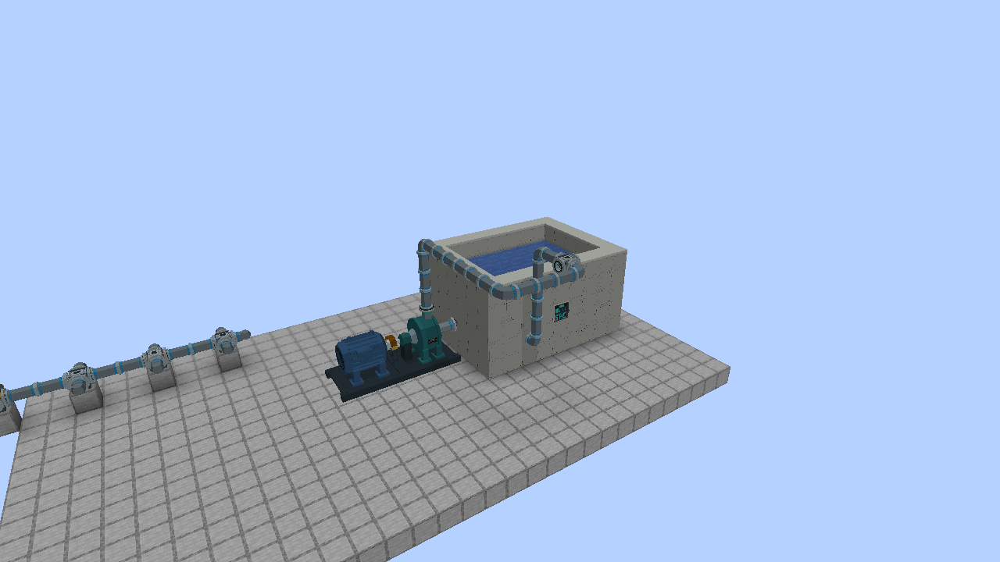
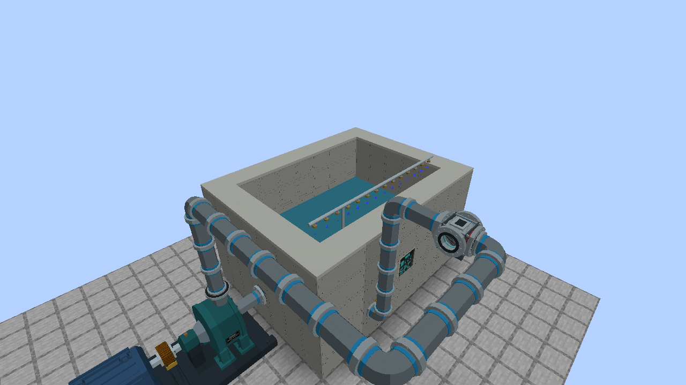
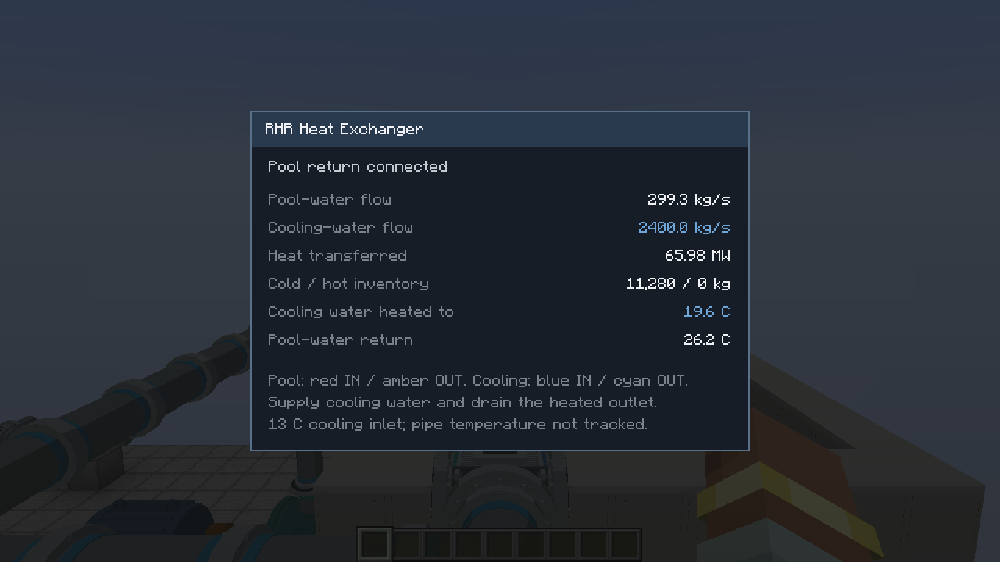

# Concrete suppression basin and RHR cooling

The suppression pool can now be built as an open concrete tub. Its wall panels,
coping, water flanges and four-port RHR heat exchanger were authored in Blender.
Existing dug pools remain supported; dedicated water ports opt a pool into the
new concrete-shell rules.



## Build the basin

1. Build a complete rectangular floor and four walls from **Suppression Pool
   Concrete**. Leave the top open. Outside width and depth may each be 5–25
   blocks; outside height may be 4–16 blocks.
2. Replace one shell block with a **Suppression Pool Controller**. Use exactly
   one controller. Keep adjacent basins' concrete shells separate.
3. Replace side-wall blocks with **Suppression Pool Suction Port** and
   **Suppression Pool Return / Fill Port**, with their round flanges facing outside.
   Ports go above the floor and below the rim. Multiple ports are allowed and
   share the same water inventory.
4. Leave the interior dry. The shell needs at least **64 interior spaces below
   the rim**. Not every minimum-dimension combination provides enough volume.
   Formation is automatic; allow up to five seconds after completing the shell.
   Sneak-click the controller for validation details.
5. Connect a powered makeup-water pump or configured fluid pipe to the **amber
   Return / Fill Port**. New basins start at **0 kg**. Ordinary source-water
   blocks inside the shell do not fill the metered tank.
6. Route steam over the rim to suppression-pool quenchers. A concrete water
   flange is not a steam inlet. Quenchers need the pumped water surface more
   than 0.05 block above their top to provide a submerged discharge path.

A **9 wide × 5 high × 7 deep** basin has 7 × 3 × 5 water spaces below its rim:
**105,000 kg** design capacity. Each interior space adds 1,000 kg of capacity.
The Blender water surface rises and falls with the stored inventory. It is a
rendered tank volume, not scoopable/swimmable Minecraft source-water blocks.

Breaking a wall disables the basin's ports and hides the assembled water/header
rendering until repaired. Required chunks must be loaded. Water, heat and queued
spray supply survive repair, controller replacement and revalidation. Resizing
never replenishes or discards stored water. Previously metered basins keep their
inventory when upgrading; new concrete basins require pipe-delivered water.
Legacy dug pools retain their earlier source-water construction behavior.

## Regular fill and over-pool spray



Right-click the controller or a water port and choose an inlet mode:

- **Regular fill:** incoming water mixes directly into the pool.
- **Over-pool spray:** the same inlet supplies the modeled riser and overhead
  nozzle rail. A shared **6,000 kg header** meters up to **600 kg/s** into the
  pool. The header is finite and reserves space against the basin's capacity;
  extra return ports do not multiply its flow or storage limits.

Cold droplets can capture part of the steam that the hot bulk pool fails to
condense. Capture is limited by incoming steam, actual spray-water mass and the
water's heat margin to one degree below local saturation. Warm supply captures
less; supply at/above that temperature captures none. Spray water and captured
steam join the pool with their heat. Spray does **not** destroy heat or replace
RHR cooling. Switching back to fill drains held spray water into the pool without
losing it. Leave capacity for incoming water and condensate; a full basin refuses
new supply. Condensation above nominal capacity is retained in the inventory,
with the rendered surface capped below the rim; spilling is not simulated.

The panel reports water level, temperature, bulk condensation, escaping steam,
physical RHR cooling, header inventory, spray flow and steam captured. CC:Tweaked:

```lua
pool.setFillMode("fill")  -- or "spray"; operator-selected, no automatic start
print(pool.getFillMode())
local status = pool.getStatus()
print(status.sprayHeaderKg, status.sprayFlowKgPerS, status.sprayCondensedKgPerS)
```

Supply water uses its transported temperature; untagged external water enters
at **13 C**. BWR water pipes preserve the supplied enthalpy. The spray
calculation handles currently arriving steam escaping the bulk pool; there is
no stored containment steam atmosphere or containment-pressure simulation yet.
The physical closed RHR/exchanger circuit remains a separate heat-removal path;
it does not count as externally supplied spray water.

## Natural cooling

A formed pool now loses heat gradually to a fixed **25 C ambient** while its
chunks are ticking. No pump, power, water injection or operator command is
required. Hotter water loses heat faster; exposed water area, wetted walls/floor
and stored water mass determine the rate. Cooling slows as the pool approaches
ambient and never takes it below ambient. Colder supplied water is not warmed
by this cooling-only approximation.

This is a simple game model: effective surface and shell conductances are
100 and 25 W/(m2 K), respectively. It does not simulate evaporation, water loss,
biome temperature, warming containment air or cooling while unloaded. Both
concrete and legacy dug pools receive passive cooling. Concrete wetted wall
area follows the pumped level; legacy boundary areas are cached during scans.

For scale, a full 9x5x7 basin containing 105,000 kg at 80 C cools to approximately
**77.3 C after one simulated hour**, with no incoming heat. RHR is still the
much stronger cooling path during steam discharge. The panel shows **Natural
cooling** in kW; CC:Tweaked exposes `getStatus().passiveCoolingMW` and
`getStatus().ambientTemperatureC`. RHR energy accounting remains separate.

## Direct LPCI/RHR connection

Connect the **blue suction flange** to the modeled **LPCI/RHR pump's suction**,
either touching it directly or using High-Pressure Water Pipe.

- For reactor injection, connect the pump discharge to an RPV Water Injection
  Port and use the pump's vessel-injection mode.
- For direct pool circulation, connect discharge to the **amber basin return**,
  choose suppression-pool suction and pool-cooling mode, supply FE, then start
  the pump. **Direct circulation adds no cooling of its own**; the pool's slow
  natural cooling continues independently.
- The basin return accepts ordinary water; the suction port only allows
  extraction above the pool's existing suction floor. Both expose directional
  NeoForge water capabilities, including for Mekanism Mechanical Pipes.

## Four-port heat exchanger

One block has **four total horizontal flanges**, two for each independent circuit:

| Identification band | Circuit | Connection |
| --- | --- | --- |
| Red | Pool water IN | RHR pump discharge |
| Amber | Pool water OUT | Return to the same suppression basin |
| Blue | Cooling water IN | Cooling-water pump / cold supply |
| Cyan | Cooling water OUT | Heated water back to cooling tower |

When its red flange faces north, amber faces south, blue west and cyan east.
Placement rotates all four together. Top and bottom are not water connections.

```text
pool suction -> powered RHR pump -> RED [heat exchanger] AMBER -> pool return
                                            || heat
cold water / cooling pump -------> BLUE [separate circuit] CYAN -> cooling tower
```

Use **BWR High-Pressure Water Pipe for the complete primary pool loop**. The
exchanger recognizes a running modeled RHR pump and a return to that same basin;
its primary circuit circulates pool water without creating another copy of the
pool inventory. Primary exchanger flanges do not expose generic fluid tanks.
Use one RHR pump per exchanger; parallel cooling trains can share the basin.

The secondary flanges accept BWR water pipes or NeoForge-compatible fluid pipes,
including Mekanism. Supply cold water to blue and drain heated water at cyan.
The exchanger pushes its hot outlet into an adjacent accepting pipe or tank;
it does not pull water from an unpumped remote source. Keep the two circuits
separate when routing pipes. Crossed or incomplete primary plumbing stops RHR
delivery. No water crosses between the circuits.

The exchanger is passive and needs no FE of its own. RHR pumping and any
cooling-water pump/fan still require their usual energy and player commands.
Right-click the exchanger for live flow, transferred heat, inventories and
temperature estimates. Right-click a basin water port to open its pool panel.
The concrete pool panel displays physical exchanger cooling instead of the old
abstract cooling-duty slider. Existing pump local and CC controls still apply.



## Current thermal model

- Maximum exchanger duty: **100 MW**, limited by actual primary flow, pool
  temperature and secondary-water availability.
- Separate cold and hot buffers: **12,000 kg each**; secondary flow up to
  **2,400 kg/s**. These are gameplay ratings, not a vendor-certified design.
- Secondary inlet uses the actual water temperature. Heat gain is bounded by
  an 11 C design range and the primary-water temperature. Connect a cooling
  tower to remove that heat. BWR pipes carry enthalpy; see
  [transport and third-party limits](PLANT-TRANSPORT.md).
- Dry secondary supply, a full hot buffer, a stopped pump or a broken primary
  return stops heat transfer. The physical model removes heat from the pool
  and adds that heat to the secondary water before it leaves the exchanger.
- There is no built-in automatic RHR start, trip or emergency control logic.

## Assets and verification

Editable source: `art/models/suppression/suppression_pool_and_heat_exchanger.blend`.
`build_models.py` runs in Blender; `tools-export-suppression.py` converts its
exported meshes to the NeoForge OBJ resources. `--check` verifies generated files.
Walls and ports use baked block models, not moving entities; neither has a server ticker.
The basin controller and exchanger handle physical updates. The client controller animates spray droplets only while water actually flows. Pipe segments retain
their existing machine-driven network behavior.

Regression coverage includes formation, unique ownership, break/repair, cached
fluid handlers after reload, all four exchanger orientations, separate water
inventories, finite cooling, fractional transfer accounting, and preservation of
condensed water during revalidation.

Detailed pump and spray source: `art/models/cooling/revise_pumps.py` (run inside
Blender), `art/models/cooling/{circulating_water_pump,makeup_water_pump}.blend`
and `art/models/suppression/pool_water_and_spray.blend`. Spray components use the
same deterministic OBJ exporter as the concrete panels.
